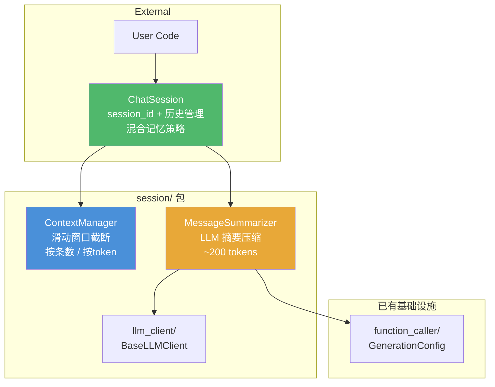
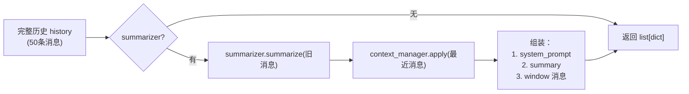

# Session Management & Context Memory Package — session/


---
title: Session Management & Context Memory Package — session/
type: feature
status: planned
branch: feature/session-package
created: 2026-07-14
---

# Plan: Session Management & Context Memory Package (`session/`)

## Overview

在现有 `demo_agent` 项目中新增 `session/` 包，实现上下文管理与对话记忆，包含 `ContextManager`（滑动窗口截断）、`MessageSummarizer`（LLM 摘要压缩）、`ChatSession`（会话管理 + 混合记忆策略）。复用现有 `llm_client/` 和 `function_caller/config.py`。**TDD**：先写测试定义接口与预期行为，再写实现。

## Design Decisions (已确认)

| # | 决策 | 选择 |
|---|------|------|
| 1 | Token 计数 | `tiktoken`，支持 token 级截断 |
| 2 | 摘要长度 | 200 tokens，参数化可配 |
| 3 | 持久化 | 纯内存 + 可选 `to_dict()`/`from_dict()` 序列化 |
| 4 | 消息格式 | OpenAI 兼容 `{"role": "...", "content": "..."}` |
| 5 | 混合策略 | `ChatSession` 内部集成 `ContextManager` + `MessageSummarizer` |

## Architecture



## Package Structure

```
session/
├── __init__.py              # exports: ContextManager, MessageSummarizer, ChatSession
├── context_manager.py       # ContextManager class
├── summarizer.py            # MessageSummarizer class
└── chat_session.py          # ChatSession class
tests/
└── test_session.py          # all tests for session/ package
```

---

## API Design

### ContextManager

```python
class ContextManager:
    def __init__(
        self,
        max_messages: int | None = None,    # 按条数截断，None = 不限制
        max_tokens: int | None = None,       # 按 token 截断，None = 不限制
        preserve_system: bool = True,        # 是否保留 system 消息在顶部
        model: str = "gpt-4o",               # tiktoken 模型名，用于 token 计数
    ): ...

    def apply(self, messages: list[dict]) -> list[dict]:
        """截断消息列表，返回滑动窗口内的消息。"""
        ...

    @staticmethod
    def count_tokens(messages: list[dict], model: str = "gpt-4o") -> int:
        """计算消息列表的总 token 数。"""
        ...
```

截断逻辑：
1. 如果 `preserve_system=True`，先取出 system 消息，其余入窗口计算
2. 优先按 `max_tokens` 截断（从后往前保留）；未设则按 `max_messages` 截断
3. system 消息放回结果最前面

### MessageSummarizer

```python
class MessageSummarizer:
    def __init__(
        self,
        client,                               # BaseLLMClient，实现 chat_completion
        config: GenerationConfig | None = None,  # 默认 chat() 预设
        max_summary_tokens: int = 200,        # 摘要目标长度
    ): ...

    def summarize(self, messages: list[dict]) -> str:
        """调用 LLM 将对话压缩为摘要文本。"""
        ...

    def estimate_tokens(self, text: str) -> int:
        """估算文本的 token 数。"""
        ...
```

摘要策略：
- 排除 system 消息，只对 user/assistant 对话做摘要
- 空消息列表返回空字符串 `""`
- 摘要结果可序列化（纯文本字符串）

### ChatSession

```python
class ChatSession:
    def __init__(
        self,
        context_manager: ContextManager,
        summarizer: MessageSummarizer | None = None,
        system_prompt: str | None = None,
        session_id: str | None = None,        # None = 自动生成 uuid4
    ): ...

    @property
    def session_id(self) -> str: ...
    @property
    def history(self) -> list[dict]: ...       # 完整历史（只读视图）

    def add_message(self, role: str, content: str) -> None:
        """追加一条消息到历史。"""
        ...

    def get_context(self) -> list[dict]:
        """返回组装好的上下文，可直接喂给 LLM。
        顺序：system_prompt → summary(旧消息) → window(最近消息)
        """
        ...

    def last_summary(self) -> str | None:
        """最近一次生成的摘要，无摘要时返回 None。"""
        ...

    # 序列化
    def to_dict(self) -> dict: ...
    @classmethod
    def from_dict(cls, data: dict, ...) -> "ChatSession": ...
```

**混合记忆策略 (get_context 核心逻辑)：**



具体步骤：
1. 取 `history` 中最近 `N` 条消息（N = `max_messages` 或 token 预算允许的范围）
2. 如果还有更早的历史 + summarizer 存在 → 调用 `summarizer.summarize(older_messages)` 生成摘要
3. 组装：`[{"role": "system", "content": system_prompt + summary}] + window_messages`
4. 如果没有 summarizer → 只做滑动窗口截断

---

## Test Strategy (`tests/test_session.py`)

### ContextManager Tests

| 测试方法 | 验证点 |
|---------|--------|
| `test_truncate_by_message_count` | 消息数超过 max_messages，截断正确 |
| `test_truncate_by_token_limit` | token 数超过 max_tokens，按 token 截断 |
| `test_preserve_system_message` | system 消息始终保留在结果顶部 |
| `test_empty_messages` | 空列表返回空列表 |
| `test_within_limit_no_truncation` | 消息不超标时不截断 |
| `test_count_tokens_static` | count_tokens 返回合理的 token 数 |
| `test_both_limits_token_priority` | 同时设 max_messages 和 max_tokens，token 优先 |
| `test_no_limits_returns_all` | max_messages=None, max_tokens=None 返回全部 |

### MessageSummarizer Tests

| 测试方法 | 验证点 |
|---------|--------|
| `test_summarize_calls_llm_client` | summarize 确实调用了 client.chat_completion |
| `test_summarize_returns_string` | 返回值是字符串 |
| `test_empty_messages_returns_empty_string` | 空消息列表返回 "" |
| `test_summarize_excludes_system_messages` | system 消息不参与摘要 |
| `test_summary_length_within_limit` | 摘要长度不超过 max_summary_tokens |
| `test_summarize_uses_config` | GenerationConfig 参数透传给了 LLM |

### ChatSession Tests

| 测试方法 | 验证点 |
|---------|--------|
| `test_session_id_auto_generated` | 自动生成 uuid4 格式的 session_id |
| `test_session_id_custom` | 可以传入自定义 session_id |
| `test_add_message_appends_to_history` | add_message 追加到 history |
| `test_history_is_read_only_view` | history 属性返回副本，外部修改不影响内部 |
| `test_get_context_without_summarizer` | 无 summarizer 时，get_context = 截断的历史 |
| `test_get_context_system_prompt_at_top` | system_prompt 在上下文最前面 |
| `test_to_dict_and_from_dict` | 序列化往返一致性 |

### Hybrid Memory Tests

| 测试方法 | 验证点 |
|---------|--------|
| `test_old_messages_summarized` | 超出窗口的旧消息被转化为摘要 |
| `test_recent_messages_kept_verbatim` | 窗口内的最近消息保持原文 |
| `test_summary_in_context_format` | 摘要以 system 消息形式出现在上下文中 |
| `test_no_summarizer_skips_summary` | 未提供 summarizer 时不生成摘要 |

### Stress Test

| 测试方法 | 验证点 |
|---------|--------|
| `test_50_rounds_token_budget` | 50 轮对话后，get_context 的 token 数不超限 |
| `test_50_rounds_smoke` | 50 轮对话正常运行，不抛异常 |

---

## Tasks

### Task 1: `ContextManager` 类 (TDD)
**顺序：** test → implement → refactor
- 更新 `requirements.txt` 追加 `tiktoken`
- 创建 `tests/test_session.py`，编写 ContextManager 8 个测试
- 实现 `session/context_manager.py`
- 实现 `session/__init__.py`
- 测试通过

### Task 2: `MessageSummarizer` 类 (TDD)
- 在 `tests/test_session.py` 中编写 Summarizer 6 个测试（含 mock LLM client）
- 实现 `session/summarizer.py`
- 更新 `session/__init__.py`
- 测试通过

### Task 3: `ChatSession` 类 + 混合记忆 (TDD)
- 在 `tests/test_session.py` 中编写 ChatSession 6 个测试 + Hybrid Memory 4 个测试
- 实现 `session/chat_session.py`
- 更新 `session/__init__.py`
- 测试通过

### Task 4: 压力测试 (TDD)
- 在 `tests/test_session.py` 中编写 50 轮对话压力测试
- 验证 token 预算不超限
- 全量测试通过

### Task 5: 回归验证
- `python -m pytest tests/ -v` — 全部测试通过
- 确认现有测试未被破坏

## Tasks

- [ ] Task 1: ContextManager 类 (TDD)
- [ ] Task 2: MessageSummarizer 类 (TDD)
- [ ] Task 3: ChatSession 类 + 混合记忆 (TDD)
- [ ] Task 4: 压力测试 (TDD)
- [ ] Task 5: 回归验证
