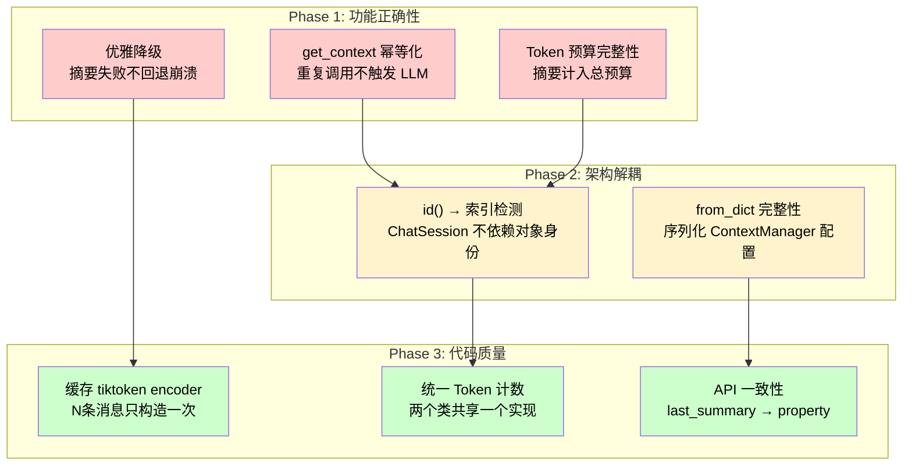

# Session Package Quality Improvements


---
title: Session Package Quality Improvements
type: refactor
status: planned
created: 2026-07-14
---

# Plan: Session Package Quality Improvements

## Overview

对 `session/` 包的代码审查发现的 7 个功能正确性 + 架构健壮性问题进行定向改进。分 3 个阶段，每阶段独立可交付，不影响已有测试。

## 改进范围



---

## Phase 1: 功能正确性 (High Priority)

### 1.1 `get_context()` 幂等化

**问题：** 每次调用 `get_context()` 都会重新摘要，浪费 LLM 调用。

**方案：** 引入内部版本号 `_history_version`，仅在历史变更后重新计算。

```python
class ChatSession:
    def __init__(self, ...):
        self._history_version = 0
        self._cached_context: list[dict] | None = None
        self._cached_summary: str | None = None  # 与 _last_summary 合并

    def add_message(self, role, content):
        self._history.append(...)
        self._history_version += 1          # 递增版本号
        self._cached_context = None         # 清除缓存

    def get_context(self):
        if self._cached_context is not None:
            return self._cached_context     # 命中缓存
        # ... 计算新上下文 ...
        self._cached_context = context
        return context
```

**需新增测试：**
- `test_get_context_idempotent` — 连续两次 `get_context()` 返回相同结果，且摘要 LLM 仅被调用一次

---

### 1.2 Token 预算完整性

**问题：** 摘要被追加到 system_prompt 后，总 token 数 = `max_tokens` + 摘要 token，可能超出 LLM context limit。

**方案：** 截断窗口时预留 system_prompt 和可能摘要的 token 空间。

```python
def get_context(self):
    # 计算 system_prompt 的 overhead
    overhead_tokens = self._count_system_overhead()

    # 用 ContextManager 截断时，传入有效的 token 预算
    # 当前 ContextManager 不感知 summary，所以用 max_tokens - overhead 作为实际限制
    window = self._context_manager.apply(self._history)  # 内部已按 max_tokens 截断

    # 组装后做一次总预算检查：如果 summary 导致超限，截断 summary
    context = self._assemble(system_prompt, summary, window)
    if TOKEN_COUNT(context) > BUDGET:
        summary = TRUNCATE_SUMMARY(summary)  # 截断摘要而不是丢弃窗口消息
```

**需新增测试：**
- `test_summary_within_total_budget` — 摘要 + 窗口总 token ≤ max_tokens
- `test_long_summary_truncated_not_dropped` — 摘要过长时截断而非丢弃

---

### 1.3 摘要失败优雅降级

**问题：** LLM 摘要异常时，整个 `get_context()` 崩溃。

**方案：** catch 异常，记录警告，降级为无摘要模式。

```python
def get_context(self):
    ...
    if older_messages and self._summarizer:
        try:
            summary = self._summarizer.summarize(older_messages)
        except Exception as e:
            import logging
            logging.warning("Summarization failed, continuing without summary: %s", e)
            summary = None
    ...
```

**需新增测试：**
- `test_summarize_failure_returns_context_without_summary` — LLM 异常时上下文仍可用
- `test_summarize_failure_logs_warning` — 异常被记录

---

## Phase 2: 架构解耦 (Medium Priority)

### 2.1 用索引替代 `id()` 检测

**问题：** `ChatSession` 用 `id(m)` 检测哪些消息被 `ContextManager` 截断，耦合到对象身份。

**方案：** `ContextManager.apply()` 额外返回截断边界信息。

```python
class ContextManager:
    def apply(self, messages: list[dict]) -> tuple[list[dict], int]:
        """返回 (截断后消息, 保留的消息数量)。
        
        truncated_count = len(messages) - kept_count，即被截断的消息数。
        """
        ...
        return result, len(non_system_result)

# ChatSession 使用：
window, kept = self._context_manager.apply(self._history)
older = self._history[: -kept] if kept < len(self._history) else []
```

**影响：** `apply()` 返回值从 `list[dict]` 变为 `tuple[list[dict], int]`，需要更新所有调用方和测试。

**需更新测试：**
- 所有 ContextManager 测试的 `apply()` 调用需要解包 tuple

---

### 2.2 `from_dict` 完整性

**问题：** 往返序列化不保存 `ContextManager` 配置和摘要。

**方案：** `to_dict()` 加入 config 信息，`from_dict()` 自动重建。

```python
def to_dict(self):
    return {
        "session_id": self.session_id,
        "system_prompt": self._system_prompt,
        "context_config": {
            "max_messages": self._cm.max_messages,
            "max_tokens": self._cm.max_tokens,
            "preserve_system": self._cm.preserve_system,
            "model": self._cm.model,
        },
        "history": list(self._history),
        "last_summary": self._last_summary,
    }

@classmethod
def from_dict(cls, data, summarizer=None):
    return cls(
        context_manager=ContextManager(**data["context_config"]),
        summarizer=summarizer,
        system_prompt=data["system_prompt"],
        session_id=data["session_id"],
    )
```

**需更新测试：**
- `test_to_dict_and_from_dict` — 验证 ContextManager 配置在往返后一致

---

## Phase 3: 代码质量 (Low Priority)

### 3.1 缓存 tiktoken encoder

**问题：** `_truncate_by_tokens` 循环内每消息调用 `count_tokens` → 每次创建 encoder。

**方案：** 循环前创建一次 encoder。

```python
def _truncate_by_tokens(self, messages):
    try:
        enc = tiktoken.encoding_for_model(self.model)
    except KeyError:
        enc = tiktoken.get_encoding("cl100k_base")

    kept = []
    total = 0
    for msg in reversed(messages):
        tokens = self._count_single(msg, enc)  # 传入预创建的 encoder
        if total + tokens > (self.max_tokens - 4):
            break
        kept.append(msg)
        total += tokens
    return list(reversed(kept))
```

**影响：** 纯性能优化，无行为变化。已有测试应保持通过。

---

### 3.2 统一 Token 计数

**问题：** `ContextManager.count_tokens` 和 `MessageSummarizer.estimate_tokens` 实现不一致。

**方案：** 提取共享的 `_get_encoder(model)` 工具函数，两处统一调用。

```python
# session/_token_utils.py（新增）
def get_encoder(model: str = "gpt-4o"):
    try:
        return tiktoken.encoding_for_model(model)
    except KeyError:
        return tiktoken.get_encoding("cl100k_base")

def count_tokens(messages: list[dict], model: str = "gpt-4o") -> int:
    enc = get_encoder(model)
    total = 0
    for msg in messages:
        total += 4  # message overhead
        for key, value in msg.items():
            if isinstance(value, str):
                total += len(enc.encode(value))
    return total

def estimate_text_tokens(text: str) -> int:
    enc = get_encoder()
    return len(enc.encode(text))
```

**需更新：**
- `ContextManager.count_tokens` → 调用共享工具
- `MessageSummarizer.estimate_tokens` → 调用共享工具

---

### 3.3 API 一致性

**问题：** `session_id` 和 `history` 是 `@property`，`last_summary()` 是普通方法。

**方案：** 统一改为 `@property`。

```python
@property
def last_summary(self) -> str | None:
    return self._last_summary
```

**影响：** `session.last_summary()` → `session.last_summary`。需要更新测试。

---

## Tasks

### Phase 1: 功能正确性
- [ ] Task 1.1: `get_context()` 幂等化（版本号 + 缓存）
- [ ] Task 1.2: Token 预算完整性（摘要计入总预算）
- [ ] Task 1.3: 摘要失败优雅降级（try/except + 降级）

### Phase 2: 架构解耦
- [ ] Task 2.1: `apply()` 返回截断边界 + 用索引替代 `id()`
- [ ] Task 2.2: `to_dict()`/`from_dict()` 序列化 ContextManager 配置

### Phase 3: 代码质量
- [ ] Task 3.1: 缓存 tiktoken encoder
- [ ] Task 3.2: 提取共享 `_token_utils` 统一计数
- [ ] Task 3.3: `last_summary` 改为 `@property`

## 回归验证
- [ ] 所有 28 个现有测试 + 新增测试全部通过
- [ ] 164 个已有测试未破坏

## Risks & Mitigations

| Risk | Impact | Mitigation |
|------|--------|------------|
| `apply()` 返回值变更破坏所有调用方 | High | 一次性更新 session/ 三个文件和测试 |
| 幂等缓存与实际状态不一致 | Medium | 版本号在每次 `add_message` 时递增，清除缓存 |
| Token 预算计算过于保守导致窗口过小 | Low | 保留 configurable `summary_overhead_ratio` 参数 |

## Key Decisions

1. **`apply()` 返回值改为 tuple** — 返回截断后的消息 + 保留数量，替代脆弱的 `id()` 检测。
2. **摘要失败降级而非重试** — 简单可靠，调用方可以自行实现重试逻辑。
3. **共享 token 工具而非注入** — 提取为模块级函数，避免 DI 复杂度。

## Tasks

- [ ] Task 1.1: get_context() 幂等化
- [ ] Task 1.2: Token 预算完整性
- [ ] Task 1.3: 摘要失败优雅降级
- [ ] Task 2.1: apply() 返回截断边界 + 索引替代 id()
- [ ] Task 2.2: to_dict/from_dict 序列化 ContextManager 配置
- [ ] Task 3.1: 缓存 tiktoken encoder
- [ ] Task 3.2: 提取共享 _token_utils 统一计数
- [ ] Task 3.3: last_summary 改为 @property
