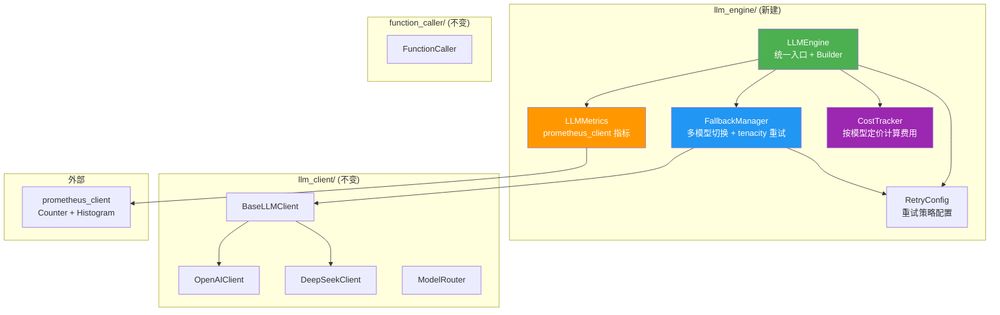
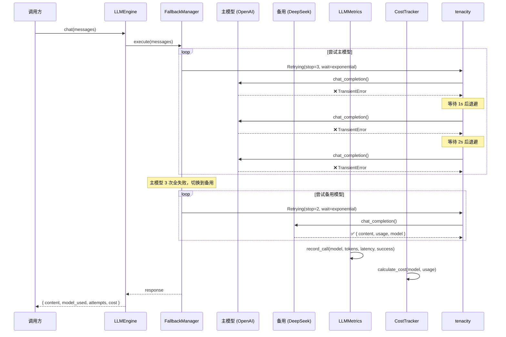

# llm_engine 多模型 Fallback 与监控包

# Plan: llm_engine 多模型 Fallback 与监控包

## Summary

在现有 `llm_client/` 之上新建 `llm_engine/` 包，为 LLM API 调用增加韧性层（Fallback + Retry）和可观测层（Metrics + Cost Tracking）。采用学习优先策略：装饰器模式和 Builder 模式都亲手实现，prometheus_client 直接集成并提供可视化 demo。

## Architecture Diagram



## Tasks

- [ ] Task 1: 创建 `llm_engine/` 包骨架和自定义异常
  - AC: `llm_engine/__init__.py`、`exceptions.py` 就位，`AllModelsExhaustedError` 等异常可正常导入
  - AC: 所有模块文件含完整的中文 docstring 和类型注解

- [ ] Task 2: 实现 `RetryConfig` + tenacity 集成
  - AC: `RetryConfig` 支持 `max_attempts`、`backoff`（exponential/fixed/linear）、`min_wait`、`max_wait`
  - AC: 提供装饰器版本 `retry_decorator` 和编程式版本 `Retrying` 对象两种用法
  - AC: 区分可重试异常（TransientError）和不可重试异常（NonRetryableError）

- [ ] Task 3: 实现 `FallbackManager`
  - AC: 接收 `list[BaseLLMClient]`，按顺序尝试调用
  - AC: 每个客户端内部使用 tenacity 重试（可配置）
  - AC: 记录每次切换行为（哪个模型失败、切到哪个）
  - AC: 所有客户端耗尽时抛出 `AllModelsExhaustedError`

- [ ] Task 4: 实现 `LLMMetrics`（prometheus_client）
  - AC: 定义 `llm_call_total`（Counter，按 model + status 分 label）
  - AC: 定义 `llm_token_usage_total`（Counter，按 model + type 分 label）
  - AC: 定义 `llm_latency_seconds`（Histogram，按 model 分 label）
  - AC: `record_call()` 方法在一次调用后更新全部指标

- [ ] Task 5: 实现 `CostTracker`
  - AC: 内置至少 4 个模型的定价表（gpt-4o、gpt-4o-mini、deepseek-chat、deepseek-reasoner）
  - AC: 根据 response 中的 `usage` 字段计算单次调用费用
  - AC: 支持累计费用查询 `get_total_cost()` 和按模型分组的费用查询 `get_cost_by_model()`

- [ ] Task 6: 实现 `LLMEngine` 统一入口 + Builder 模式
  - AC: `LLMEngine(primary, fallbacks, retry, metrics, cost_tracking)` 直接构造可用
  - AC: `LLMEngine.builder()` 流式构造可用（学习 Builder 模式）
  - AC: `chat()` 方法串联 Fallback → Retry → Metrics → Cost 全流程
  - AC: `stream()` 方法预留接口，首版 raise NotImplementedError

- [ ] Task 7: 编写测试
  - AC: `test_retry.py` — 验证 tenacity 两种方式、不同退避策略
  - AC: `test_fallback.py` — 验证模型切换、全部耗尽场景、异常分类
  - AC: `test_metrics.py` — 验证 Counter/Histogram 正确递增
  - AC: `test_cost.py` — 验证定价计算准确、累计费用正确
  - AC: `test_engine.py` — 验证端到端串联、Builder 模式

- [ ] Task 8: 编写示例 `examples/llm_engine_demo.py`
  - AC: 启动 metrics HTTP server，暴露 `/metrics` 端点
  - AC: 模拟主模型失败 → 降级到备用模型的完整流程
  - AC: 用 curl 或浏览器可查看 Prometheus 指标

## Technical Approach

### Phase 1: 异常体系 + RetryConfig

创建 `llm_engine/exceptions.py`：

```python
class LLMEngineError(Exception):
    """llm_engine 包所有异常的基类。"""

class TransientError(LLMEngineError):
    """瞬态错误——应该重试。如：超时、429 rate limit、5xx。"""

class NonRetryableError(LLMEngineError):
    """不可重试错误——直接失败。如：401 认证失败、400 参数错误。"""

class AllModelsExhaustedError(LLMEngineError):
    """所有模型（含备用）均已尝试且失败。"""
```

创建 `llm_engine/retry.py`：

```python
@dataclass
class RetryConfig:
    max_attempts: int = 3
    backoff: str = "exponential"  # exponential | fixed | linear
    min_wait: float = 1.0
    max_wait: float = 60.0
    retryable_exceptions: tuple[type[Exception], ...] = (TransientError,)

    def to_tenacity_wait(self):
        """将配置转为 tenacity 的 wait 策略。"""
        ...

    def to_tenacity_stop(self):
        """将配置转为 tenacity 的 stop 策略。"""
        ...

    def build_retrying(self):
        """返回一个配置好的 tenacity.Retrying 对象。"""
        ...
```

### Phase 2: FallbackManager

```python
class FallbackManager:
    def __init__(
        self,
        clients: list[BaseLLMClient],
        retry_config: RetryConfig | None = None,
    ) -> None:
        self._clients = clients
        self._retry_config = retry_config or RetryConfig()
        self._callbacks: list[Callable] = []  # 用于注入 metrics/cost

    def execute(self, messages: list[dict], **kwargs) -> dict:
        """按顺序尝试每个客户端，内部带 tenacity 重试。"""
        ...

    def on_attempt(self, callback: Callable) -> None:
        """注册回调，每次 API 调用前后触发。"""
        ...
```

### Phase 3: LLMMetrics + CostTracker

```python
class LLMMetrics:
    def __init__(self) -> None:
        self.call_total = Counter("llm_call_total", "...", ["model", "status"])
        self.token_usage = Counter("llm_token_usage_total", "...", ["model", "type"])
        self.latency = Histogram("llm_latency_seconds", "...", ["model"])

    def record_call(
        self, model: str, tokens: dict, latency_ms: float, success: bool
    ) -> None:
        """记录一次调用的全部指标。"""
        ...
```

```python
class CostTracker:
    # 定价表（USD / 1M tokens）
    PRICING = {
        "gpt-4o": {"prompt": 2.50, "completion": 10.00},
        "gpt-4o-mini": {"prompt": 0.15, "completion": 0.60},
        "deepseek-chat": {"prompt": 0.14, "completion": 0.28},
        "deepseek-reasoner": {"prompt": 0.55, "completion": 2.19},
    }

    def calculate_cost(self, model: str, usage: dict) -> float:
        """根据 usage 和定价表计算单次调用费用。"""
        ...
```

### Phase 4: LLMEngine + Builder

```python
class LLMEngine:
    def __init__(self, ...): ...

    @staticmethod
    def builder() -> "LLMEngineBuilder": ...

    def chat(self, messages, config=None) -> dict: ...

    def stream(self, messages, **kwargs):
        raise NotImplementedError("流式暂不支持")

class LLMEngineBuilder:
    def primary(self, client): ...
    def add_fallback(self, client): ...
    def with_retry(self, max_attempts, backoff, ...): ...
    def with_metrics(self): ...
    def with_cost_tracking(self): ...
    def build(self) -> LLMEngine: ...
```

## Data Flow



## Risks & Mitigations

| Risk | Impact | Likelihood | Mitigation |
|------|--------|------------|------------|
| prometheus_client 引入 C 扩展安装失败 | 中 | 中 | Python 纯文本模式兜底，文档注明可能需要 `pip install prometheus-client` |
| 多模型 fallback 导致费用失控 | 中 | 低 | CostTracker 记录每次调用费用，`get_total_cost()` 可随时审计 |
| tenacity 重试指数退避参数不对导致等待过久 | 低 | 中 | `max_wait` 硬上限 60s，测试验证退避时间 |
| 定价表过时 | 低 | 高 | 定价表写死在代码中，文档注明参考日期，注释链接到官方定价页 |

## Estimated Effort

- **Complexity**: Medium
- **Time Estimate**: 6-8 小时（对应课程表的 6 个编码时段）
- **Dependencies**: `tenacity>=8.0.0`, `prometheus-client>=0.19.0`（新增到 requirements.txt）

## Key Decisions

1. **Decision**: 新建 `llm_engine/` 而非扩展 `llm_client/`
   **Rationale**: 学习 Service Layer 模式——在上层包裹下层而不改动它，是后端开发核心直觉。

2. **Decision**: FallbackManager 不依赖 ModelRouter
   **Rationale**: 直接管理客户端列表让 Fallback 循环逻辑透明可见，学习价值更高。

3. **Decision**: 同时提供 `@retry` 装饰器和 `Retrying` 对象两种 tenacity 用法
   **Rationale**: 学习目标——理解声明式重试和编程式重试的区别和适用场景。

4. **Decision**: 直接使用 prometheus_client 而非分层可选方案
   **Rationale**: 课程表明确要求学 Prometheus，不要绕路。

5. **Decision**: Builder 模式 + 直接构造双模式
   **Rationale**: Builder 用于学习 GoF 模式，直接构造用于实际使用的简洁性。

## Suggested Branch Name
`feature/llm-engine-fallback-monitoring`

## Tasks

- [ ] Task 1: 创建 llm_engine/ 包骨架和自定义异常
- [ ] Task 2: 实现 RetryConfig + tenacity 集成
- [ ] Task 3: 实现 FallbackManager
- [ ] Task 4: 实现 LLMMetrics（prometheus_client）
- [ ] Task 5: 实现 CostTracker
- [ ] Task 6: 实现 LLMEngine 统一入口 + Builder 模式
- [ ] Task 7: 编写测试
- [ ] Task 8: 编写示例 examples/llm_engine_demo.py
