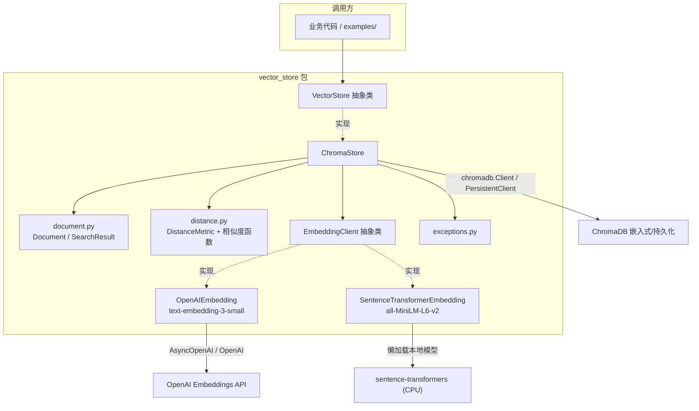
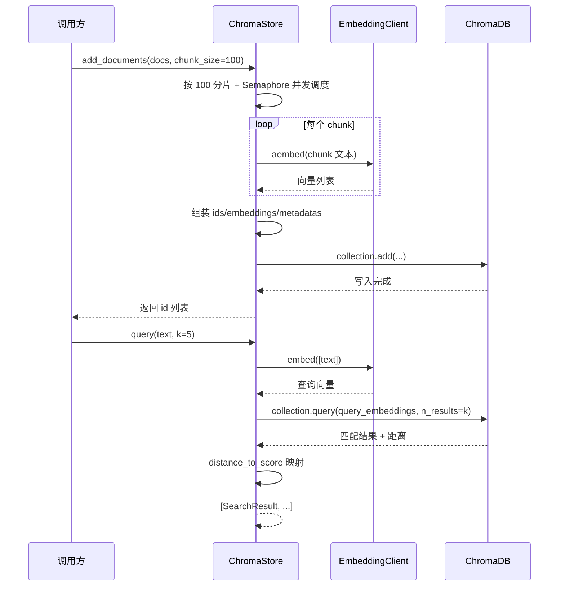

# Day 6 — Embedding 与向量数据库（vector_store/ 包）

# Plan: Day 6 — Embedding 与向量数据库（`vector_store/` 包）

## Summary

构建 `vector_store/` 包：一个 `VectorStore` 抽象层（首个实现 `ChromaStore`，基于 ChromaDB 嵌入式/持久化模式），配合双后端 `EmbeddingClient`（OpenAI 远程 / sentence-transformers 本地），支持 `chunk_size=100` 的批量并发插入（asyncio 分片调度），并交付单元测试、集成测试，以及 1000 条文档的 QPS / 召回性能测试。Qdrant 仅提供 docker-compose 起服务，不写实现。全部代码遵循项目现有约定：类型注解 + 中文 docstring、`ABC`+`abstractmethod`、`__init__.py` 显式 `__all__`。

## Architecture Diagram

## Tasks

- [ ] Task 1：基础设施与包骨架
  - AC: `requirements.txt` 追加 `chromadb`、`sentence-transformers`（`openai`/`pytest` 已有）
  - AC: 根目录新增 `docker-compose.yml`，含 Qdrant 服务 + Chroma 的注释说明（不起 Chroma 服务）
  - AC: 创建 `vector_store/` 目录与 `exceptions.py`（`VectorStoreError` 基类 + `EmbeddingError` + `DimensionMismatchError`）
- [ ] Task 2：数据模型 `document.py`
  - AC: `Document` dataclass：`text` / `metadata`（默认 `{}`）/ `id`（`None` 时在 `__post_init__` 生成 `uuid4().hex`）
  - AC: `SearchResult` dataclass：`id` / `text` / `metadata` / `score`（越高越相似）/ `distance`（越低越近）
- [ ] Task 3：相似度 `distance.py`
  - AC: `DistanceMetric(str, Enum)`：`COSINE` / `L2` / `IP`（值 `"cosine"` / `"l2"` / `"ip"`）
  - AC: `cosine_similarity` / `dot_product` / `euclidean_distance` 纯函数
  - AC: `distance_to_score(metric, distance)`：cosine→`1-distance`，ip→`-distance`，l2→`-distance`
- [ ] Task 4：Embedding 子包 `embeddings/`
  - AC: `base.py` `EmbeddingClient(ABC)`：抽象 `dimension` 属性 + 抽象 `embed(texts)` + 默认 `aembed()`（`asyncio.to_thread(embed)`）
  - AC: `openai_embedding.py` `OpenAIEmbedding`：默认 `text-embedding-3-small`（1536 维）、`dimensions` 可选、`api_key` 走 `os.environ`、同步 `embed` 用 `OpenAI`、`aembed` 用 `AsyncOpenAI`
  - AC: `sentence_transformer.py` `SentenceTransformerEmbedding`：默认 `all-MiniLM-L6-v2`、懒 import + 懒加载模型（未装 torch 不影响包导入）
  - AC: `embeddings/__init__.py` 显式导出
- [ ] Task 5：`chroma_store.py` 实现 `VectorStore`
  - AC: 构造参数：`embedding` / `collection_name` / `metric` / `client`（可注入 mock）/ `persist_directory`（有则 `PersistentClient`）
  - AC: 懒创建 collection：首次 `add/query` 按 `embedding.dimension` 创建，维度与已存在 collection 不一致时抛 `DimensionMismatchError`
  - AC: `add_documents(documents, chunk_size=100, concurrency=4)`：同步方法，内部 `asyncio.run` + `asyncio.Semaphore` 分片并发，返回 id 列表
  - AC: `query` / `query_by_vector`（`k=5`，`where=None` 透传）返回 `list[SearchResult]`
  - AC: `delete(ids)` / `count()`
- [ ] Task 6：`vector_store/__init__.py`
  - AC: 显式 `__all__` 导出 `VectorStore`、`ChromaStore`、`EmbeddingClient`、`OpenAIEmbedding`、`SentenceTransformerEmbedding`、`Document`、`SearchResult`、`DistanceMetric`、异常
- [ ] Task 7：单元测试（mock，离线）
  - AC: `tests/fakes.py` 提供 `HashEmbedding`（文本 hash → 固定维度向量，确定性）
  - AC: `tests/test_document.py` / `test_distance.py` / `test_embeddings.py`（mock 后端）/ `test_chroma_store.py`（mock chroma client + mock embedding）
  - AC: 覆盖：懒创建 collection、维度不匹配抛错、分片并发调用次数、`distance_to_score` 映射、uuid 自动生成
- [ ] Task 8：集成 + 性能测试
  - AC: `tests/test_chroma_store_integration.py`（`@pytest.mark.integration`，真 `chromadb.Client()` 进程内 duckdb，可跳过）
  - AC: `tests/test_perf.py`（`@pytest.mark.slow`，1000 条 `HashEmbedding`，测 QPS = 条数/秒 + 自监督召回 top-k 命中率）
  - AC: `examples/vector_store_perf.py` 可独立运行并打印 QPS / 召回 / 耗时

## Technical Approach

### Phase 1：数据模型与相似度（Task 2–3）
先落地无外部依赖的纯 Python 部分：`Document`/`SearchResult` dataclass、`DistanceMetric` 枚举、三个相似度纯函数 + `distance_to_score` 映射。这是后续一切的类型基础，也是单测最容易覆盖的部分。

### Phase 2：Embedding 抽象与双后端（Task 4）
`EmbeddingClient` 抽象类只暴露两件事：`dimension` 和 `embed(texts) -> list[list[float]]`；异步由基类默认 `aembed()` 用 `asyncio.to_thread` 包一层。两个实现：
- `OpenAIEmbedding` 同步用 `OpenAI`、异步用 `AsyncOpenAI`（SDK 底层即 httpx），避免额外引入 `httpx`。
- `SentenceTransformerEmbedding` 在方法体内才 `import sentence_transformers`，首次 `embed` 时才加载模型，保证没装 torch 的用户仍能 `import vector_store` 且只用 ChromaStore+OpenAI。

### Phase 3：`ChromaStore` 实现（Task 5）
核心三件事：
1. 懒建 collection：`_ensure_collection()` 在首次读写时按 `embedding.dimension` 调 `client.get_or_create_collection`，校验维度。
2. 同步门面 + 异步核心：`add_documents` 对外同步，内部 `asyncio.run(_add_documents_async(...))`；异步核心按 `chunk_size=100` 分片，用 `Semaphore(concurrency)` 控制并发，每片 `await embedding.aembed(texts)` 后组装 `ids/embeddings/metadatas/documents` 调 `collection.add`。
3. 查询与映射：`query` 先把文本 embed 成向量再 `collection.query`，把 Chroma 返回的 `distance` 经 `distance_to_score` 转成 `SearchResult.score`。

### Phase 4：导出与测试（Task 6–8）
`__init__.py` 收敛对外 API。测试三层：
- 单测（mock）：`HashEmbedding` + `MagicMock` chroma client，验证懒创建、维度校验、分片并发调用次数、映射函数、uuid。
- 集成：真 `chromadb.Client()`（进程内 duckdb，无 docker），跑真实增删查，用 `@pytest.mark.integration` 标记可跳过。
- 性能：`@pytest.mark.slow` + 独立 `examples/vector_store_perf.py`，1000 条文档跑 QPS（条数/耗时）与自监督召回（`query(doc_i.text)` 断言 `doc_i.id` 进 top-k）。

## Data Flow

## Risks & Mitigations

| Risk | Impact | Likelihood | Mitigation |
|------|--------|------------|------------|
| `sentence-transformers` 拖入 torch（~2GB），安装重、CI 慢 | High | High | 懒 import + 懒加载模型；不装也能用 OpenAI 后端；集成/单测不依赖它 |
| `chromadb` 依赖重（onnxruntime、hnswlib 等） | Medium | High | 硬依赖无法避免，但在 `requirements.txt` 用宽松版本；单测用 mock 不加载它 |
| `asyncio.run` 在已有事件循环环境（Jupyter/异步框架）中调用报错 | Medium | Medium | `add_documents` 为同步门面，内部检测运行中 loop 时走 `to_thread` 回退（`asyncio.run` 仅用于无 loop 场景）；文档注明 |
| 维度错配（换 embedding 后端后 collection 维度对不上） | Medium | Medium | 懒创建时校验，抛 `DimensionMismatchError`，异常信息给出期望/实际维度 |
| 性能测试不稳定（CI 机器差异） | Low | Medium | 用确定性 `HashEmbedding`，报告的是相对数字；`@slow` 标记默认不跑 |
| Chroma `ip`/`l2` 距离语义与 `score` 的映射易错 | Low | Medium | 集中在 `distance_to_score` 一处，单测锁死三者的映射规则 |

## Estimated Effort

- **Complexity**: Medium
- **Time Estimate**: 约 1 天（与 Day 6 课时对应）；实现约 4–6h，测试约 2–3h
- **Dependencies**: `chromadb`、`sentence-transformers`（新）；`openai`、`pytest`（已有）；无跨包依赖

## Key Decisions

1. `VectorStore`/`EmbeddingClient` 均用 `ABC`+`abstractmethod`，镜像 `llm_client/base.py`
   理由：与项目既有抽象风格一致，便于后续加 `QdrantStore` 作为第二个实现验证「一接口多实现」。
2. `add_documents` 同步门面 + 内部 `asyncio.run`/`to_thread` 并发分片
   理由：对外 API 与 `LLMEngine.chat()` 一致的同步风格，异步不传染调用方；asyncio 只做调度层（Q2=d），OpenAI 后端用 `AsyncOpenAI` 落地（Q2=a）。
3. 懒创建 collection + 维度自动推导（Q3=a）
   理由：调用方无需关心维度，切换 embedding 后端时 collection 维度自动跟随，错配时显式报错。
4. sentence-transformers 懒 import/懒加载
   理由：torch 极重，保持「只装 chromadb+openai 就能跑」的最小可用面。
5. 测试三层：mock 单测为主 + `@integration` 真 Chroma + `@slow` 性能，假 embedding 放测试侧
   理由：离线、快、确定性、CI 友好；性能测试零成本、可复现。

## Suggested Branch Name

`feature/vector-store-embeddings`

## Tasks

- [ ] Task 1：基础设施与包骨架（requirements.txt / docker-compose.yml / exceptions.py）
- [ ] Task 2：数据模型 document.py（Document / SearchResult）
- [ ] Task 3：相似度 distance.py（DistanceMetric + 相似度函数 + distance_to_score）
- [ ] Task 4：Embedding 子包 embeddings/（base / OpenAIEmbedding / SentenceTransformerEmbedding）
- [ ] Task 5：chroma_store.py 实现 VectorStore（懒建 collection / 分片并发插入 / query）
- [ ] Task 6：vector_store/__init__.py 显式 __all__ 导出
- [ ] Task 7：单元测试（mock + HashEmbedding 假 embedding）
- [ ] Task 8：集成测试（真 chromadb.Client）+ 性能测试（1000 条 QPS/召回）
