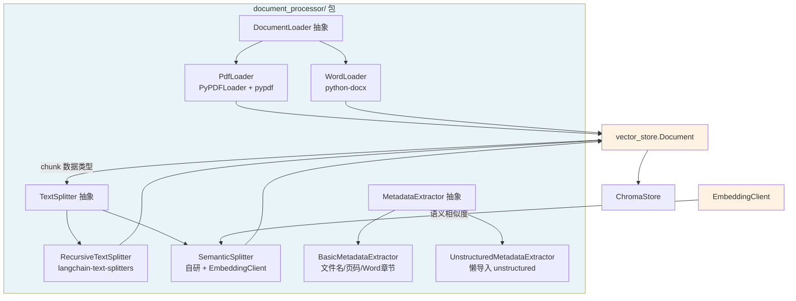
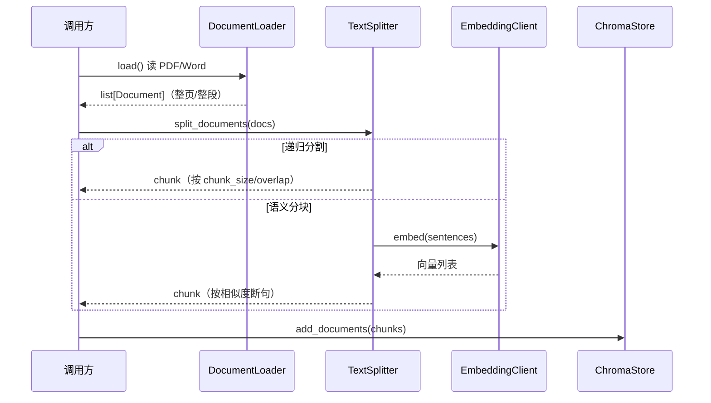

# Day 7 — 文档处理与分块策略（document_processor/ 包）

# Plan: Day 7 — 文档处理与分块策略（`document_processor/` 包）

## Summary

在 Day 6 的 `vector_store/` 包之上，新增 `document_processor/` 包，补齐 RAG 链路的上游——**「原始文件 → 文本 chunk」**。包含三组能力：**加载器**（PDF/Word）、**分割器**（递归字符分割 + 语义分块）、**元数据提取**（文件名/类型/页码/章节/时间戳）。复用 `vector_store.Document` 作为 chunk 数据类型、`vector_store.embeddings.EmbeddingClient` 作为语义分块的嵌入来源，形成 `loader → splitter → ChromaStore` 的无缝 pipeline。

## Architecture Diagram

## Tasks

- [ ] Task 1: 包骨架 + 异常体系
  - AC: 创建 `document_processor/` 目录结构，`exceptions.py` 定义 `DocumentProcessorError`（基类）及 `DocumentLoadError` / `DocumentSplitError` / `MetadataExtractionError` 三个子类
  - AC: `__init__.py` 用中文 docstring 说明包定位，`__all__` 显式导出公开 API
  - AC: 所有类/方法含类型注解 + 中文文档字符串（项目规范）
- [ ] Task 2: `DocumentLoader` 抽象 + `PdfLoader`
  - AC: `loaders/base.py` 定义 `DocumentLoader(ABC)`，抽象方法 `load() -> list[Document]`（复用 `vector_store.Document`）
  - AC: `PdfLoader` 内部用 `PyPDFLoader` 加载，逐页产出 `Document`，metadata 含 `page`/`source`；LangChain `Document` 正确适配为 `vector_store.Document`
  - AC: 文件不存在/加载失败时抛 `DocumentLoadError`
- [ ] Task 3: `WordLoader`
  - AC: 用 `python-docx` 遍历段落，产出 `Document`，metadata 含 `source`/`paragraph_index`；识别 Heading 样式填充 `section` 字段
- [ ] Task 4: `TextSplitter` 抽象 + `RecursiveTextSplitter`
  - AC: `splitters/base.py` 定义 `TextSplitter(ABC)`：`split_text(text) -> list[str]` + `split_documents(docs) -> list[Document]`
  - AC: `RecursiveTextSplitter(chunk_size, chunk_overlap, separators)` 委托 `langchain-text-splitters` 的 `RecursiveCharacterTextSplitter`，分割时保留原 metadata 并追加 `chunk_index`
- [ ] Task 5: `SemanticSplitter`（复用 `EmbeddingClient`）
  - AC: 按句切分 → 计算相邻句子 embedding 相似度 → 低于阈值处断句，参考 LlamaIndex 语义分块思路（自研，不引入 llama-index 重依赖）
  - AC: 构造注入 `EmbeddingClient`（可接 OpenAI/SentenceTransformer/HashEmbedding 任意后端），阈值/缓冲参数可配
- [ ] Task 6: `MetadataExtractor` 抽象 + `BasicMetadataExtractor`
  - AC: `metadata/base.py` 定义 `MetadataExtractor(ABC)`，抽象方法 `extract(path) -> dict[str, Any]`
  - AC: `BasicMetadataExtractor` 提取 `filename`/`file_type`/`size`/`modified_time`；PDF 追加 `page_count`；Word 追加 `sections`
- [ ] Task 7: `UnstructuredMetadataExtractor`（懒导入可选后端）
  - AC: 方法内 `import unstructured`（懒导入），用 `partition()` 提取章节/页码/标题/时间戳等
  - AC: 未安装 unstructured 时抛带清晰提示的 `MetadataExtractionError`
- [ ] Task 8: 单元测试（离线假文件）
  - AC: `tests/test_loaders.py` / `test_splitters.py` / `test_metadata.py`，用 `pypdf.PdfWriter` + `python-docx` 在 `tmp_path` 构造真实最小文件，全程离线
  - AC: 语义分块测试用 `HashEmbedding`（确定性）；递归分割测试验证 chunk 数/chunk_size/overlap/metadata 保留
- [ ] Task 9: `examples/chunking_ab_test.py`（A/B 实验 + matplotlib）
  - AC: 复用 `HashEmbedding` + `ChromaStore`，对比不同 `chunk_size`/`chunk_overlap` 的自监督召回率，matplotlib 画召回率曲线
  - AC: 独立可运行（`sys.path` 处理 + chromadb 依赖保护，风格同 `examples/vector_store_perf.py`）
- [ ] Task 10: 依赖更新 + 文档产出
  - AC: `requirements.txt` 追加 `langchain-community`、`langchain-text-splitters`、`python-docx`、`pypdf`、`unstructured`
  - AC: 写 `docs/features/2026-09-03-document-processor-package.md`（含 mermaid 架构图）

## Technical Approach

### Phase 1: 骨架与加载器（Task 1-3）

按 `vector_store/` 的既有约定组织包：每个子包有 `base.py`（抽象接口）+ 具体实现 + `__init__.py`（中文 docstring + `__all__`）。

**LangChain Document 适配**是 Phase 1 的关键点：`PyPDFLoader.load()` 返回 `langchain_core.documents.Document`，需转换为 `vector_store.Document`。写一个模块级辅助函数完成转换。

### Phase 2: 分割器（Task 4-5）

- `RecursiveTextSplitter` 直接委托 `langchain-text-splitters`（成熟的纯文本算法），注意 **metadata 透传**：split 后每个 chunk 继承源 metadata 并追加 `chunk_index`。
- `SemanticSplitter` 自研算法（复用 `EmbeddingClient`）：按句切分 → 计算相邻句子 embedding 余弦相似度 → 低于阈值处断句。

> 决策说明：语义分块对「直接引入」做了一个例外——不引入 `llama-index-core`，而是自研算法复用 `EmbeddingClient`。理由：(1) 避免重依赖 + 双向适配；(2) 算法透明可控。

### Phase 3: 元数据提取（Task 6-7）

- `BasicMetadataExtractor`：文件名/类型/大小/修改时间用 `pathlib`；页码用 `pypdf`；Word 章节用 `python-docx` 段落样式。
- `UnstructuredMetadataExtractor`：懒导入，可选后端。

### Phase 4: 测试 + 实验 + 文档（Task 8-10）

沿用 `pytest` 的 `integration`/`slow` marker；假文件用 `pypdf.PdfWriter()` 和 `docx.Document()` 在 `tmp_path` 构造。

## Data Flow

## Risks & Mitigations

| Risk | Impact | Likelihood | Mitigation |
|------|--------|------------|------------|
| `langchain-community` 依赖树庞大、版本冲突 | 高 | 中 | 锁定版本范围；PDF 若冲突可退回 `pypdf` 直连（接口已抽象，只改实现） |
| `unstructured` 系统级依赖安装失败 | 高 | 高 | 懒导入 + 默认用 `BasicMetadataExtractor`，unstructured 仅可选 |
| LlamaIndex 语义分块需双适配（若引入） | 中 | 低 | 采用自研算法复用 `EmbeddingClient`，规避 |
| 语义分块阈值难调优 | 中 | 中 | 阈值/缓冲参数化 + A/B 实验脚本暴露调参入口 |

## Estimated Effort

- **Complexity**: Medium
- **Time Estimate**: 3-4 天（含测试与实验脚本）
- **Dependencies**: `langchain-community`, `langchain-text-splitters`, `python-docx`, `pypdf`, `unstructured`（可选）；复用 `vector_store` 的 `Document` / `EmbeddingClient`

## Key Decisions

1. **Decision**: chunk 数据类型复用 `vector_store.Document`，语义分块嵌入复用 `EmbeddingClient`
   **Rationale**: 形成 `loader → splitter → ChromaStore` 无缝 pipeline，避免重复定义数据模型
2. **Decision**: 递归分割引入 `langchain-text-splitters`（纯文本、成熟、参数语义清晰）
   **Rationale**: 符合「直接引入」决定，算法成熟无需自研
3. **Decision**: 语义分块自研算法复用 `EmbeddingClient`（不引入 llama-index）
   **Rationale**: 避免重依赖 + 双适配，核心算法简单透明（Review 时可调整）
4. **Decision**: `unstructured` 作为懒导入可选后端，默认用 `BasicMetadataExtractor`
   **Rationale**: unstructured 依赖最重，懒导入避免拖慢包 import 与安装失败
5. **Decision**: A/B 实验与可视化放 `examples/`，用 matplotlib（不引入 ChunkViz 网页工具）
   **Rationale**: 实验性质不进包 API；matplotlib 已在依赖中

## Suggested Branch Name

`feature/document-processor`
## Tasks

- [ ] 包骨架 + 异常体系（DocumentProcessorError 及三个子类，__init__ 导出）
- [ ] DocumentLoader 抽象 + PdfLoader（PyPDFLoader + pypdf，Document 适配）
- [ ] WordLoader（python-docx，Heading 样式识别 section）
- [ ] TextSplitter 抽象 + RecursiveTextSplitter（langchain-text-splitters，metadata 透传）
- [ ] SemanticSplitter（自研 + 复用 EmbeddingClient，相似度断句）
- [ ] MetadataExtractor 抽象 + BasicMetadataExtractor（文件名/页码/Word章节）
- [ ] UnstructuredMetadataExtractor（懒导入可选后端）
- [ ] 单元测试（离线假文件：pypdf.PdfWriter + docx.Document）
- [ ] examples/chunking_ab_test.py（A/B 实验 + matplotlib 召回率曲线）
- [ ] 依赖更新 + 文档产出（requirements.txt + docs/features）
