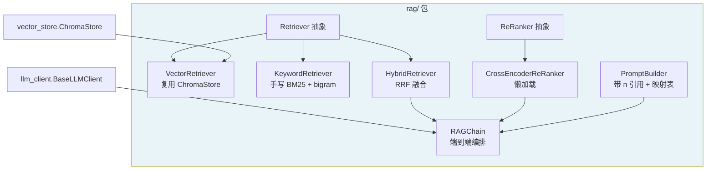
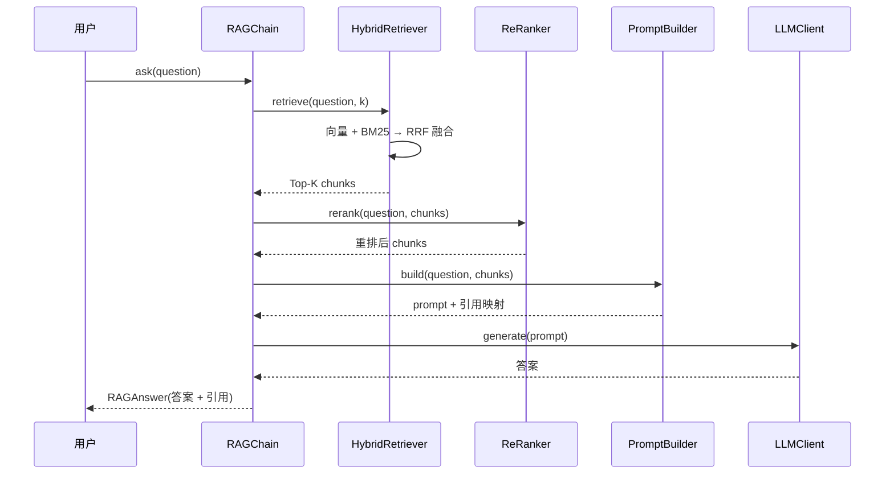

# Day 8 — RAG 核心流程（rag/ 包）

# Plan: Day 8 — RAG 核心流程（`rag/` 包）

## Summary

在 Day 6（vector_store）、Day 7（document_processor）之上，新增 `rag/` 包，打通 RAG 的**核心检索-生成链路**：多路检索（向量 + 关键词 BM25）、重排序（CrossEncoder 懒加载）、带引用的 Prompt 构建、端到端 RAGChain 编排。复用 `vector_store.ChromaStore`（向量检索）、`llm_client.BaseLLMClient`（生成层）。

## Architecture

## 关键决策

1. **ReRanker**：抽象接口 + `CrossEncoderReRanker` 懒加载（需下载模型），测试用确定性 Fake；RAGChain 中可选注入。
2. **关键词检索**：手写 BM25（学习原理）+ 字符 bigram 分词，不引入 `rank_bm25`/`jieba`。
3. **ensemble 融合**：RRF（Reciprocal Rank Fusion），量纲无关，`RRF(d) = Σ 1/(60+rank)`。
4. **生成层**：复用 `llm_client.BaseLLMClient` 抽象 + 注入，端到端测试用 mock LLM。
5. **`rag/` 不复用 `llm_engine`**（避免职责耦合），只依赖 `llm_client`/`vector_store`。
6. **引用格式**：PromptBuilder 用 `[n]` 编号引用 chunk，返回「引用映射表」`{1: {source, page, text}}`。

## Tasks

- [ ] Task 1: 包骨架 + 异常体系（RAGError 及子类）
- [ ] Task 2: `Retriever` 抽象 + `VectorRetriever`（复用 ChromaStore）
- [ ] Task 3: `KeywordRetriever`（手写 BM25 + 字符 bigram）
- [ ] Task 4: `HybridRetriever`（RRF 融合）
- [ ] Task 5: `ReRanker` 抽象 + `CrossEncoderReRanker`（懒加载）
- [ ] Task 6: `PromptBuilder`（带 [n] 引用 + 映射表）
- [ ] Task 7: `RAGChain`（端到端编排）
- [ ] Task 8: 单元测试（离线 fake）
- [ ] Task 9: 端到端测试（mock LLM + 引用准确性验证）
- [ ] Task 10: 文档产出

## Data Flow

## Suggested Branch Name

`feature/rag-core`
## Tasks

- [ ] 包骨架 + 异常体系（RAGError 及子类）
- [ ] Retriever 抽象 + VectorRetriever（复用 ChromaStore）
- [ ] KeywordRetriever（手写 BM25 + 字符 bigram）
- [ ] HybridRetriever（RRF 融合）
- [ ] ReRanker 抽象 + CrossEncoderReRanker（懒加载）
- [ ] PromptBuilder（带 [n] 引用 + 映射表）
- [ ] RAGChain（端到端编排）
- [ ] 单元测试（离线 fake）
- [ ] 端到端测试（mock LLM + 引用准确性验证）
- [ ] 文档产出
