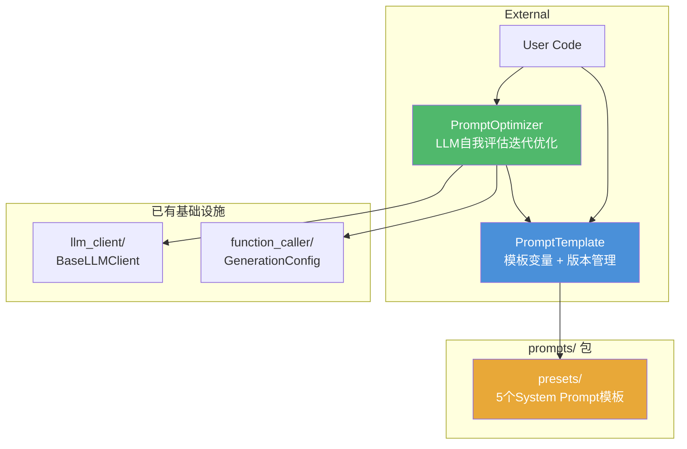
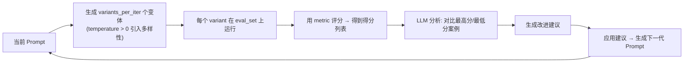

# Plan: Prompt Engineering Package (`prompts/`)

## Overview

在当前 `demo_agent` 项目中新增 `prompts/` 包，包含 `PromptTemplate`、System Prompt 模板库、`PromptOptimizer`，复用现有 `llm_client/` 和 `function_caller/config.py`。**全程 TDD**：每个组件先写测试定义接口与预期行为，再写实现。

## Architecture



## Package Structure

```
prompts/
├── __init__.py
├── template.py              # PromptTemplate 核心类
├── optimizer.py             # PromptOptimizer 核心类
├── presets/
│   ├── __init__.py
│   ├── code_review.py
│   ├── translator.py
│   ├── summarizer.py
│   ├── classifier.py
│   └── roleplay.py
└── experiments/
    ├── cot_comparison.ipynb
    └── fewshot_comparison.ipynb
tests/
├── test_prompt_template.py
└── test_prompt_optimizer.py
```

---

## Detailed Design

### PromptTemplate

**API 契约（先写测试，锁定接口）：**

```python
# 构造
template = PromptTemplate("Hello, {{ name }}!")
template = PromptTemplate("Hello, {{ name }}!", version=1, metadata={"author": "me"})

# 渲染
template.render(name="World")  # → "Hello, World!"

# 不可变修改 — 返回新实例，原实例不变
v2 = template.with_var("name", "Alice")  # 新 PromptTemplate，version=2

# 多变量
template = PromptTemplate("{{ role }}: {{ action }}")
template.render(role="Assistant", action="reply")

# 转义语法
template = PromptTemplate("Use \{\{ and \}\} for braces")

# 错误处理
template.render()           # ValueError: 未绑定变量 'name'
template.render(name=1)      # 正常 — 转为字符串 "1"
```

**PromptTemplate 完整测试战略（`tests/test_prompt_template.py`）：**

| 测试类 | 测试方法 | 验证点 |
|--------|---------|--------|
| `TestConstruction` | `test_construct_with_defaults` | version=1, metadata为空 |
| | `test_construct_with_custom_version` | 自定义version |
| | `test_construct_with_metadata` | metadata正确存储 |
| | `test_empty_template` | 空模板字符串合法 |
| `TestRender` | `test_render_single_variable` | 单变量替换 |
| | `test_render_multiple_variables` | 多变量替换 |
| | `test_render_with_repeated_variable` | 同一变量多次出现 |
| | `test_render_preserves_non_template_text` | 非模板文本保留 |
| `TestImmutability` | `test_with_var_returns_new_instance` | 返回新对象 |
| | `test_with_var_does_not_mutate_original` | 原对象不变 |
| | `test_with_var_increments_version` | version递增 |
| | `test_chain_multiple_with_var` | 链式调用正确 |
| `TestEdgeCases` | `test_missing_variable_raises` | ValueError |
| | `test_unused_kwargs_ignored_or_raises` | 多余参数行为明确 |
| | `test_variable_with_special_chars` | 变量值含特殊字符 |
| `TestEscaping` | `test_escaped_braces_literal` | `\{` 不被当作变量 |
| | `test_mixed_escaped_and_variable` | 转义与变量混合 |
| `TestEquality` | `test_same_template_equal` | 同内容同版本 → `==` |
| | `test_different_version_not_equal` | 不同版本 → `!=` |
| | `test_different_template_not_equal` | 不同内容 → `!=` |

### System Prompt Presets

**5 个预设模板设计：**

| 模板 | 变量 | 原始 Prompt 风格 |
|------|------|-----------------|
| `CodeReviewer` | `language, focus, style` | Anthropic 系统级审查员: 分析代码质量/安全/风格 |
| `Translator` | `source_lang, target_lang, tone` | 专业翻译: 保持语义+文化适配 |
| `Summarizer` | `format, max_length, audience` | 结构化总结: 支持 bullet/paragraph/executive |
| `Classifier` | `categories, input_format` | 多标签分类: 严格JSON输出 |
| `RolePlayer` | `role_name, persona, scenario` | 角色扮演: 完整人设+行为指导 |

**模板测试战略（`tests/test_prompt_template.py`）：**

| 测试类 | 测试方法 | 验证点 |
|--------|---------|--------|
| `TestCodeReviewerPreset` | `test_renders_all_variables` | 渲染后包含 `language`, `focus`, `style` |
| | `test_output_length_reasonable` | 渲染后长度 > 200 chars |
| | `test_defaults_exist` | 默认值合理 |
| | `test_preset_version_is_one` | 版本从1开始 |
| `TestTranslatorPreset` | `test_renders_source_and_target` | 源/目标语言正确替换 |
| | `test_tone_parameter` | tone 参数生效 |
| `TestSummarizerPreset` | `test_format_parameter` | format 参数替换 |
| | `test_max_length_parameter` | max_length 出现在渲染结果中 |
| `TestClassifierPreset` | `test_categories_as_list` | 分类列表正确渲染 |
| | `test_json_output_instruction` | 包含JSON格式说明 |
| `TestRolePlayerPreset` | `test_persona_detail_present` | 人物设定完整 |
| | `test_scenario_parameter` | 场景参数替换 |
| `TestAllPresets` | `test_all_presets_are_prompt_template` | 所有预设是 PromptTemplate 子类/实例 |
| | `test_all_presets_render_without_error` | 默认参数全部渲染成功 |

### PromptOptimizer

**API 契约（先写测试，锁定接口）：**

```python
# 数据结构
@dataclass
class EvalCase:
    input: str
    expected: str
    metadata: dict = field(default_factory=dict)

@dataclass  
class OptimizationResult:
    best_template: PromptTemplate
    history: list[dict]   # 每轮的 variants + scores + analysis
    iterations: int

# 优化器
optimizer = PromptOptimizer(
    client=my_llm_client,             # BaseLLMClient
    config=GenerationConfig.code(),   # LLM 评估/优化时使用
)

result = optimizer.optimize(
    seed_template=PromptTemplate("Classify: {{ text }}"),
    eval_set=[EvalCase("text1", "label1"), EvalCase("text2", "label2")],
    metric=lambda prediction, expected: float(len(set(prediction.split()) & set(expected.split())) > 0),
    iterations=5,
    variants_per_iter=3,
)
```

**优化循环内部逻辑（每个迭代）：**



**`PromptOptimizer` 完整测试战略（`tests/test_prompt_optimizer.py`）：**

Mock LLM client 是测试的关键——优化器需要 LLM 同时"评估"和"优化"，但在测试中由 mock 返回预定义响应。

| 测试类 | 测试方法 | 验证点 |
|--------|---------|--------|
| `TestEvalCase` | `test_eval_case_fields` | 结构正确 |
| | `test_eval_case_default_metadata` | metadata默认空 |
| `TestOptimizationResult` | `test_result_structure` | best_template + history + iterations |
| | `test_history_tracks_each_iteration` | 每轮都有记录 |
| `TestOptimizeSingleIteration` | `test_single_iteration_returns_result` | 1轮优化返回有效结果 |
| | `test_seed_unchanged` | seed_template 不被修改 |
| `TestOptimizeConvergence` | `test_metric_improves_or_stays` | 最佳分数不降 |
| | `test_variants_generated` | 每轮生成指定数量的变体 |
| `TestMetricInjection` | `test_custom_metric_called` | 自定义metric确实被调用 |
| | `test_metric_receives_correct_args` | 参数传递正确 |
| | `test_perfect_score_stops_early` | metric=1.0 时可提前终止 |
| `TestEdgeCases` | `test_empty_eval_set_raises` | 空评估集抛错 |
| | `test_single_eval_case_ok` | 单case合法 |
| | `test_max_iterations_boundary` | iterations > 0 校验 |
| `TestOptimizerConfig` | `test_config_passed_to_llm` | GenerationConfig 透传给 LLM 调用 |
| | `test_default_config_is_code_preset` | 默认使用 code() 预设 |

### 实验 Notebook（不限测试）

| Notebook | 内容 | 输出 |
|----------|------|------|
| `cot_comparison.ipynb` | 10道数学推理题，对比有/无 CoT 提示的准确率 | 准确率对比表 + 柱状图 |
| `fewshot_comparison.ipynb` | 同一任务 (如分类)，对比 0/2/4/6 shots | 准确率-样本数折线图 + 边际收益分析 |

---

## Tasks

### Task 1: `PromptTemplate` 核心类 (TDD)
**顺序：** test → implement → refactor
- 创建 `tests/test_prompt_template.py`，编写 `TestConstruction` + `TestRender`
- 实现 `prompts/template.py` 通过前两类测试
- 编写 `TestImmutability` + `TestEdgeCases` + `TestEscaping` + `TestEquality`
- 完善实现通过全部测试
- 更新 `prompts/__init__.py`

### Task 2: 5 个 System Prompt 预设 (TDD)
**顺序：** test → implement (每个模板独立)
- 编写预设相关测试（`TestCodeReviewerPreset` ~ `TestAllPresets`）
- 逐个实现 `presets/code_review.py` ~ `presets/roleplay.py`
- 实现 `presets/__init__.py`
- 全量测试通过

### Task 3: `PromptOptimizer` 核心类 (TDD)
**顺序：** test → implement → verify
- 创建 `tests/test_prompt_optimizer.py`，编写 `TestEvalCase` + `TestOptimizationResult`
- 实现 `EvalCase` 和 `OptimizationResult` dataclasss
- 编写 `TestOptimizeSingleIteration` + `TestOptimizeConvergence`
- 实现优化循环核心逻辑
- 编写 `TestMetricInjection` + `TestEdgeCases` + `TestOptimizerConfig`
- 完善实现通过全部测试
- 更新 `prompts/__init__.py`

### Task 4: 实验 Notebook
- 创建 `cot_comparison.ipynb`：CoT vs 无 CoT 数学推理对比
- 创建 `fewshot_comparison.ipynb`：0/2/4/6 shots 对比

### Task 5: 回归验证
- `python -m pytest tests/ -v` — 全部测试通过
- 确认现有 `tests/test_function_caller.py` 未破坏
- 更新 `requirements.txt`（如有新依赖，如 `jupyter`）
