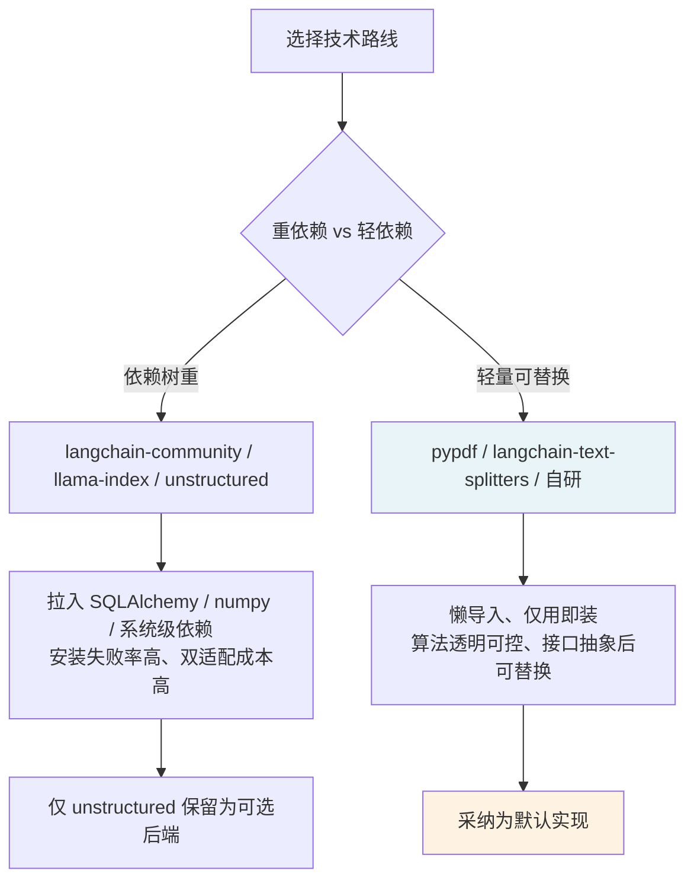

# Document Processor 依赖与实现选型（pypdf 直连 / 语义分块自研）

## Context

Day 7 需为 `document_processor` 包选定三块能力的技术路线：文档加载（PDF/Word）、文本分割（递归分割 + 语义分块）、元数据提取。项目既有约定是「懒导入 + 轻依赖 + 抽象接口可替换后端」（`vector_store` 的 `chromadb`/`sentence-transformers` 均为懒加载）。

学习计划原文建议使用 LangChain 的 `PyPDFLoader`、`RecursiveCharacterTextSplitter`，以及 LlamaIndex 的「Semantic Splitter」、Unstructured 库。但直接引入这些全家桶会显著增加依赖树体积与安装失败率。

## Decision

1. **PDF 加载用 `pypdf` 直连**，而非 `langchain-community` 的 `PyPDFLoader`。
2. **递归分割引入 `langchain-text-splitters`**（轻量、纯文本、参数语义清晰）。
3. **语义分块自研**（复用 `vector_store.embeddings.EmbeddingClient`），而非引入 `llama-index-core`。
4. **`unstructured` 作为懒导入可选后端**，默认用自研的 `BasicMetadataExtractor`。

## Rationale

核心权衡：

- `PyPDFLoader` 本质是 `pypdf` 的薄封装（`PdfReader` + 逐页 `extract_text`），引入 `langchain-community` 只为这一个 loader，会连带拉入 SQLAlchemy、requests、numpy 等一大串依赖，性价比极低；且加载器已抽象为 `DocumentLoader` 接口，未来要换 `PyPDFLoader` 只需改一个实现类。
- `llama-index-core` 的语义分块需要 `llama_index.BaseEmbedding`，而本项目已有 `EmbeddingClient` 抽象，直接引入需写双向适配器。语义分块核心算法（相邻句子 embedding 相似度变化处断句）简单透明，自研几行即可，且完全复用现有 `EmbeddingClient`（可接 OpenAI / SentenceTransformer / HashEmbedding 任意后端）。
- `unstructured` 是全线最重依赖（需系统级 libmagic / poppler / tesseract），仅作为可选后端懒导入，默认走 `BasicMetadataExtractor`（`pathlib` + `pypdf` + `python-docx` 即可覆盖文件名/页码/Word 章节）。

## Consequences

**正面**
- 依赖树轻，`import document_processor` 不触发任何重依赖。
- 接口抽象后各后端可无缝替换（换 `PyPDFLoader`、换 llama-index 语义分块只改实现类）。
- 语义分块算法透明，便于教学与调参（`breakpoint_threshold`/`buffer_size` 暴露）。

**负面**
- 自研语义分块需自担算法维护（未享受 LlamaIndex 的持续优化）。
- 放弃 `PyPDFLoader` 意味着未直接学习 LangChain Document Loaders 的封装写法（但其底层 `pypdf` 语义已覆盖）。
- `unstructured` 若未来启用，需额外处理系统级依赖安装。

## Related Files

- `document_processor/loaders/pdf_loader.py`
- `document_processor/splitters/semantic.py`
- `document_processor/splitters/recursive.py`
- `document_processor/metadata/unstructured_extractor.py`
- `requirements.txt`
