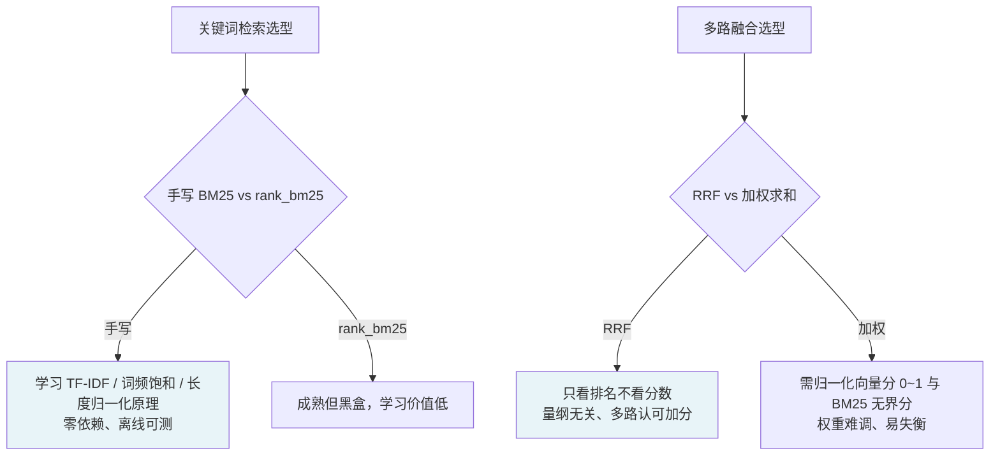

# RAG 检索与融合选型（手写 BM25 / RRF 倒数排名融合）

## Context

Day 8 在 `vector_store`（向量存储）与 `document_processor`（文档分块）之上搭建 `rag/` 包的检索层，需要为两个环节做技术选型：

1. **关键词检索**：与向量检索互补的第二路信号，用于「向量难命中、关键词能命中」的场景（如专有名词、精确术语）。
2. **多路融合**：把向量检索分数与关键词检索分数合并成一个排序。

项目约束：以学习为目的、依赖尽量轻、网络受限（模型与大型依赖难以下载）、复用既有 `EmbeddingClient`/`ChromaStore`。

## Decision

1. **关键词检索：手写 BM25 + 字符 bigram 分词**，不引入 `rank_bm25`、不引入 `jieba`。
2. **多路融合：用 RRF（Reciprocal Rank Fusion）**，而非对向量分/BM25 分加权求和。

## Rationale

- **手写 BM25 而非 `rank_bm25`**：`rank_bm25` 是成熟库，但以学习为目的，手写 IDF（`ln(1+(N-df+0.5)/(df+0.5))`）、词频饱和（`k1`）、长度归一化（`b`）才能吃透原理；且零依赖、离线可测，与项目「懒导入 + 轻依赖」风格一致。
- **字符 bigram 而非 `jieba`**：中文不分词会退化成单字统计；`jieba` 是纯 Python 但仍是额外依赖。字符 bigram（`"苹果好吃" → ["苹果","果好","好吃"]`）无依赖、足够学习场景，且对「苹果好吃」vs「苹果 好吃」这类轻微差异容忍度可接受（已在 docstring 注明局限）。
- **RRF 而非加权求和**：向量分数（归一化余弦相似度 0~1）与 BM25 分数（无上界，随文档长度/词频变化）量纲不同，直接加权需要归一化且权重难调。RRF 只看排名（`RRF(d) = Σ 1/(k+rank)`，k=60），量纲无关，且「多路都认可」的文档因在多个检索器都排前列而综合分数更高——这是 RRF 相对加权的核心优势。

## Alternatives Considered

| 方案 | 拒绝理由 |
|------|---------|
| `rank_bm25` 库 | 学习价值低（黑盒）、增加依赖 |
| `jieba` 分词 | 增加依赖，bigram 已满足学习场景 |
| 加权分数融合 | 需归一化 + 权重难调，量纲不一致易失衡 |

## Consequences

**正面**
- BM25 算法透明，参数 `k1`/`b` 可调可讲清。
- RRF 融合鲁棒，不依赖各检索器分数的绝对值。
- 全程离线、零新依赖，单测无需真实检索库即可覆盖算法。

**负面**
- 手写 BM25 是纯内存倒排索引，对超大语料/超长文档有内存膨胀风险（已记录为技术债，后续可用 SQLite FTS/Elasticsearch 替换）。
- 字符 bigram 对「中英混排带空格」的输入较敏感（内部空白会导致 bigram 不匹配）。
- RRF 丢失了分数信息（只保留排名），若未来需要精细的分数级融合需另做方案。

## 伴随决策（非核心，记录备查）

- **CrossEncoder 懒加载**：cross-encoder 模型需联网下载（约 80MB），做成懒加载，测试用确定性 Fake。
- **生成层复用 `llm_client.BaseLLMClient`，不复用 `llm_engine`**：避免职责耦合；fallback/retry 是独立能力，需要时再包一层。

## Related Files

- `rag/retrievers/keyword.py`
- `rag/retrievers/hybrid.py`
- `rag/rerankers/cross_encoder.py`
- `rag/chain.py`
