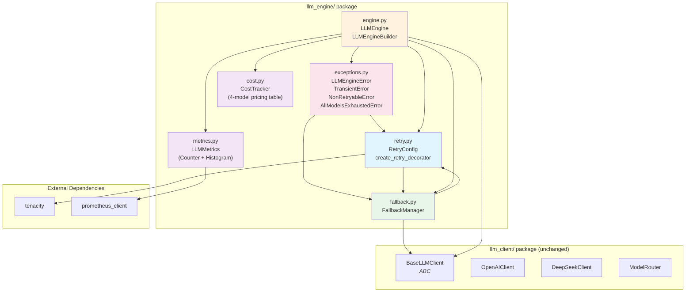
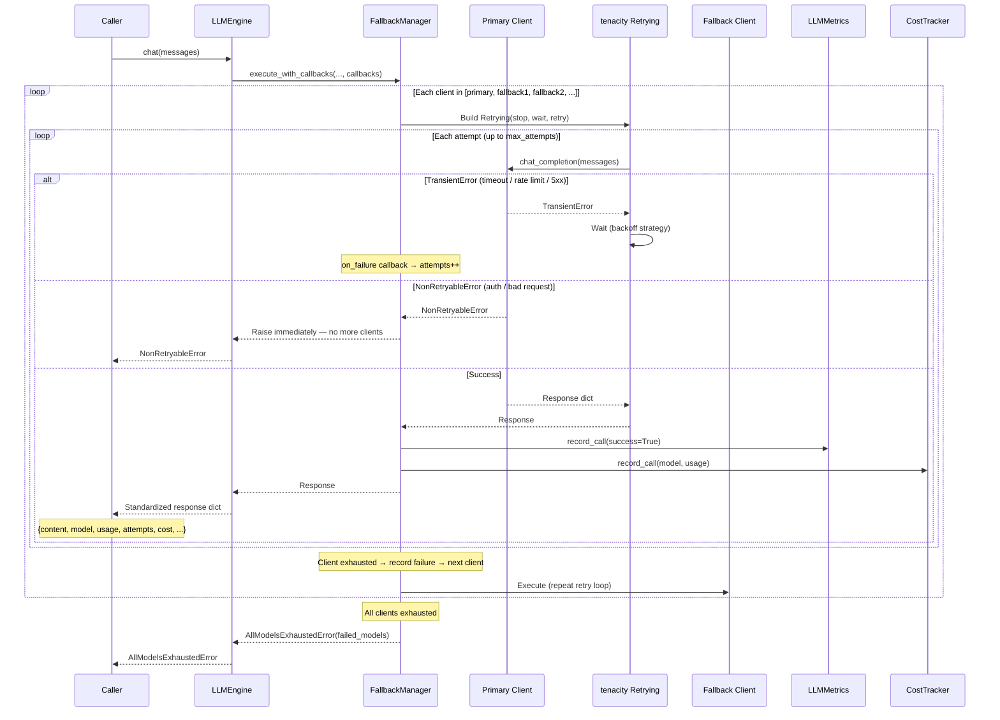

# Feature: LLM Engine Package — `llm_engine/`

## Overview

The `llm_engine/` package is a **non-invasive orchestration layer** that wraps the existing `llm_client/` package (`OpenAIClient`, `DeepSeekClient`, `ModelRouter`) without modifying it. It adds four complementary capabilities on top of raw LLM client calls:

1. **Custom Exception Hierarchy** — `LLMEngineError` base with `TransientError` (retriable) and `NonRetryableError` (fatal), plus `AllModelsExhaustedError` for complete fallback exhaustion.
2. **Configurable Retry Logic** — `RetryConfig` dataclass wrapping the `tenacity` library with three backoff strategies (exponential, fixed, linear), supporting both decorator and programmatic usage.
3. **Sequential Model Fallback** — `FallbackManager` iterates through a prioritized list of `BaseLLMClient` instances, retrying each with `tenacity` before advancing to the next.
4. **Observability** — `LLMMetrics` (Prometheus Counter + Histogram) and `CostTracker` (per-model USD pricing table) provide call-count, token-usage, latency, and cost visibility.

`LLMEngine` serves as the **unified facade**, wiring `FallbackManager`, `LLMMetrics`, and `CostTracker` together behind a single `chat()` method. A companion `LLMEngineBuilder` offers a fluent Builder-pattern API for chainable configuration.

The package has two external dependencies: `tenacity` (retry) and `prometheus_client` (metrics).

## Architecture



### Layered Dependency Flow

```
exceptions ──► retry ──► fallback ──► metrics + cost ──► engine
```

Each layer depends only on the layers to its left. Lower layers (`exceptions`, `retry`) are pure configuration with no IO; middle layers (`fallback`) orchestrate IO; the top layer (`engine`) composes everything into a single entry point.

### Relationship to `llm_client/`

| Direction | What | Why |
|-----------|------|-----|
| `llm_engine/` → `llm_client/` | `BaseLLMClient` | `FallbackManager` and `LLMEngine` accept any `BaseLLMClient` implementation (OpenAI, DeepSeek, or future providers) |
| `llm_engine/` → `function_caller/` | `GenerationConfig` | `LLMEngine.chat()` accepts an optional `GenerationConfig` and merges it into client kwargs |
| `llm_client/` → `llm_engine/` | None | `llm_client/` is completely unaware of `llm_engine/` — the wrapper is non-invasive |

## Key Components

| Component | File | Purpose |
|-----------|------|---------|
| `LLMEngineError` | `llm_engine/exceptions.py` | Base exception for all engine-originated errors |
| `TransientError` | `llm_engine/exceptions.py` | Retriable error (timeout, rate limit, 5xx) — triggers tenacity retry |
| `NonRetryableError` | `llm_engine/exceptions.py` | Fatal error (auth failure, bad request) — stops all retry/fallback immediately |
| `AllModelsExhaustedError` | `llm_engine/exceptions.py` | Raised when every model in the fallback chain has failed; carries `failed_models` detail |
| `RetryConfig` | `llm_engine/retry.py` | Declarative dataclass wrapping tenacity `stop`, `wait`, and `retry` strategies |
| `create_retry_decorator` | `llm_engine/retry.py` | Factory for tenacity `@retry` decorators configured from `RetryConfig` |
| `FallbackManager` | `llm_engine/fallback.py` | Sequential model fallback with per-client tenacity retry and callback hooks |
| `LLMMetrics` | `llm_engine/metrics.py` | Prometheus metrics collector: `llm_call_total` (Counter), `llm_token_usage_total` (Counter), `llm_latency_seconds` (Histogram) |
| `CostTracker` | `llm_engine/cost.py` | Tracks cumulative USD cost per model using a static pricing table (4 models, 2025-07 pricing) |
| `LLMEngine` | `llm_engine/engine.py` | Unified facade exposing `chat()` and `stream()` (reserved), composing Fallback + Metrics + Cost |
| `LLMEngineBuilder` | `llm_engine/engine.py` | Fluent Builder for `LLMEngine` — chainable `.primary()`, `.add_fallback()`, `.with_retry()`, `.with_metrics()`, `.with_cost_tracking()`, `.build()` |

## Usage

### Direct Construction

```python
from llm_engine import LLMEngine, RetryConfig, LLMMetrics, CostTracker
from llm_client import OpenAIClient, DeepSeekClient

# Create clients
openai = OpenAIClient(api_key="sk-...")
deepseek = DeepSeekClient(api_key="sk-...")

# Create shared observability components
metrics = LLMMetrics()
cost_tracker = CostTracker()

# Direct construction
engine = LLMEngine(
    primary=openai,
    fallbacks=[deepseek],
    retry_config=RetryConfig(max_attempts=3, backoff="exponential"),
    metrics=metrics,
    cost_tracker=cost_tracker,
)

# Make a call
response = engine.chat([{"role": "user", "content": "Hello!"}])

print(response["content"])       # "Hello! How can I help?"
print(response["model"])         # "gpt-4o"
print(response["attempts"])      # 1
print(response["cost"])          # 0.00275
print(response["finish_reason"]) # "stop"
```

### Builder Pattern

```python
engine = (
    LLMEngine.builder()
    .primary(openai)
    .add_fallback(deepseek)
    .with_retry(max_attempts=5, backoff="linear", min_wait=2.0, max_wait=30.0)
    .with_metrics()          # auto-creates LLMMetrics
    .with_cost_tracking()    # auto-creates CostTracker
    .build()
)

response = engine.chat([{"role": "user", "content": "Hello from Builder!"}])

# Access components post-build
print(engine.primary.model_name)        # "gpt-4o"
print([c.model_name for c in engine.fallbacks])  # ["deepseek-chat"]
print(engine.metrics is not None)       # True
print(engine.cost_tracker is not None)  # True
print(f"Total cost: ${engine.total_cost:.6f}")
```

### Minimal Usage (no fallback, no observability)

```python
engine = LLMEngine(primary=openai)
response = engine.chat([{"role": "user", "content": "Quick question"}])
# No metrics collected, no cost tracked, no fallback configured
```

### Standalone Retry Usage

```python
from llm_engine import RetryConfig, create_retry_decorator, TransientError

# Programmatic
config = RetryConfig(max_attempts=3, backoff="exponential")
retrying = config.build_retrying()
result = retrying(lambda: call_api(prompt), prompt)

# Decorator
decorator = create_retry_decorator(config)

@decorator
def flaky_call(prompt: str) -> str:
    # Automatically retried on TransientError
    ...
```

### Standalone Cost Tracking

```python
from llm_engine import CostTracker

ct = CostTracker()
cost = ct.record_call("gpt-4o", {"prompt_tokens": 1000, "completion_tokens": 500})
print(f"Call cost: ${cost:.6f}")      # $0.007500
print(ct.get_summary())
# {"total_cost": 0.0075, "call_count": 1, "by_model": {"gpt-4o": 0.0075}}
```

## Fallback & Retry Workflow



### Error Classification

| HTTP Status | Exception | Behavior |
|-------------|-----------|----------|
| 429 (rate limit) | `TransientError` | Retry with backoff, then fallback |
| 5xx (server error) | `TransientError` | Retry with backoff, then fallback |
| Network timeout | `TransientError` | Retry with backoff, then fallback |
| 401 (unauthorized) | `NonRetryableError` | **Immediate failure** — no retry, no fallback |
| 400 (bad request) | `NonRetryableError` | Immediate failure |
| 402 (payment required) | `NonRetryableError` | Immediate failure |
| 403 (forbidden) | `NonRetryableError` | Immediate failure |

## Standardized Response Format

Every `LLMEngine.chat()` call returns a normalized dictionary:

```python
{
    "content": str,         # Model response text
    "model": str,           # Actual model name used (e.g., "gpt-4o", "deepseek-chat")
    "usage": dict,          # Token usage: {"prompt_tokens": N, "completion_tokens": N, "total_tokens": N}
    "attempts": int,        # Total attempts across all clients (retries + fallback switches)
    "cost": float,          # USD cost of the successful call (0.0 if no CostTracker)
    "finish_reason": str,   # "stop", "length", etc.
    "raw_response": dict,   # Original response from the underlying client
}
```

## Pricing Table

Built into `CostTracker` (USD per 1M tokens, prices as of July 2025):

| Model | Prompt | Completion |
|-------|--------|------------|
| `gpt-4o` | $2.50 | $10.00 |
| `gpt-4o-mini` | $0.15 | $0.60 |
| `deepseek-chat` | $0.14 | $0.28 |
| `deepseek-reasoner` | $0.55 | $2.19 |

Unknown models log a warning and return `$0.00`.

## Prometheus Metrics

Three metrics are exposed by `LLMMetrics`:

| Metric | Type | Labels | Description |
|--------|------|--------|-------------|
| `llm_call_total` | Counter | `model`, `status` | Total API calls grouped by model and success/error |
| `llm_token_usage_total` | Counter | `model`, `type` | Token usage grouped by model and prompt/completion/total |
| `llm_latency_seconds` | Histogram | `model` | Call latency distribution in seconds (buckets: 0.1, 0.5, 1, 2, 5, 10, 30, 60, 120) |

Serve metrics via a Prometheus HTTP endpoint:

```python
from prometheus_client import start_http_server

start_http_server(9090)  # Exposes at http://localhost:9090/metrics
```

## Configuration

### RetryConfig Parameters

| Parameter | Type | Default | Description |
|-----------|------|---------|-------------|
| `max_attempts` | `int` | `3` | Maximum attempts including the first call |
| `backoff` | `str` | `"exponential"` | Backoff strategy: `"exponential"`, `"fixed"`, or `"linear"` |
| `min_wait` | `float` | `1.0` | Minimum wait time between retries (seconds) |
| `max_wait` | `float` | `60.0` | Maximum wait time cap (seconds) |
| `retryable_exceptions` | `tuple[type[Exception], ...]` | `(TransientError,)` | Exception types that trigger retry |

### Backoff Strategies

| Strategy | Wait Formula | Example (min_wait=1) |
|----------|-------------|----------------------|
| `exponential` | `2^(n-1) × min_wait`, capped at `max_wait` | 1s → 2s → 4s → 8s → ... → 60s |
| `fixed` | `min_wait` every time | 1s → 1s → 1s |
| `linear` | `n × min_wait`, capped at `max_wait` | 1s → 2s → 3s → 4s → ... → 60s |

## Limitations

- **No streaming fallback** — The `stream()` method is reserved but not yet implemented; streaming calls only use the primary client.
- **Static pricing table** — `CostTracker` pricing is hardcoded; model price changes require code updates.
- **No latency measurement** — `LLMEngine.chat()` currently passes `latency_ms=0.0` to `LLMMetrics.record_call()`. Latency tracking requires instrumentation at the client level.
- **Single-threaded fallback** — `FallbackManager` iterates clients sequentially. Parallel fan-out (racing multiple models simultaneously) is not supported.
- **No circuit breaker** — Consecutive failures on a model do not temporarily suspend it from the fallback chain.
- **Prometheus singleton — `LLMMetrics` uses class-level shared metric objects; creating multiple `LLMMetrics` instances in the same process without sharing the first one will cause Prometheus duplicate-registration errors. Pass a single instance to all `LLMEngine` instances.
- **`NonRetryableError` stops all fallback** — A fatal error from any client immediately aborts the entire chain. There is no mechanism to skip a non-retriable error and continue to the next fallback client.


## Related Files

- `llm_engine/__init__.py`
- `llm_engine/exceptions.py`
- `llm_engine/retry.py`
- `llm_engine/fallback.py`
- `llm_engine/metrics.py`
- `llm_engine/cost.py`
- `llm_engine/engine.py`
- `examples/llm_engine_demo.py`
