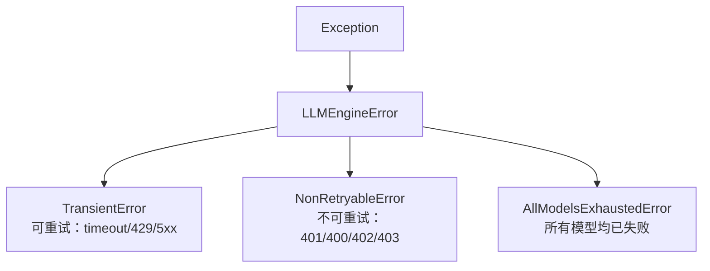
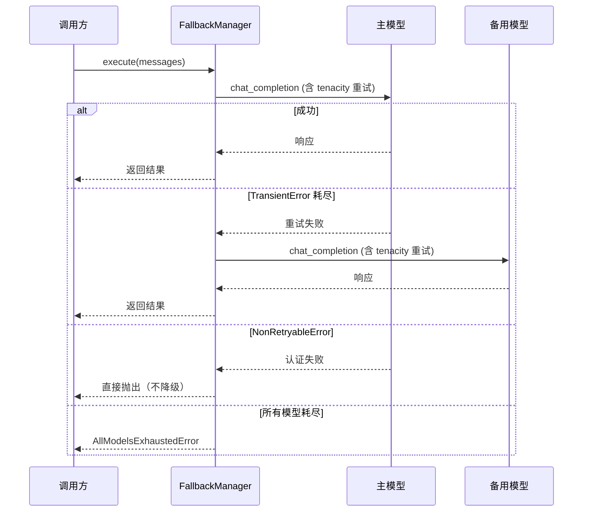
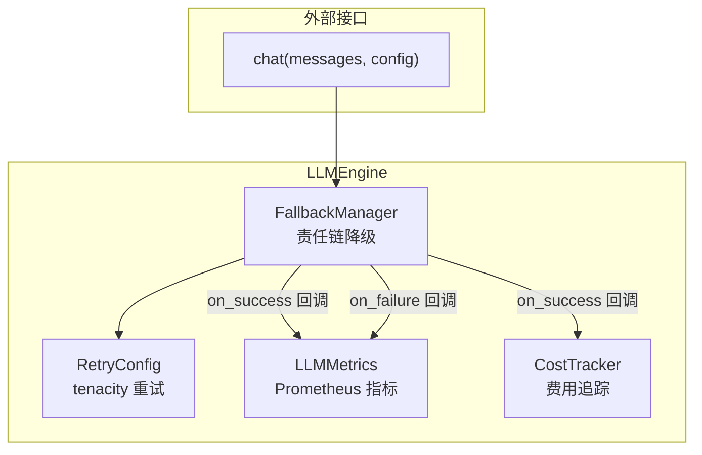
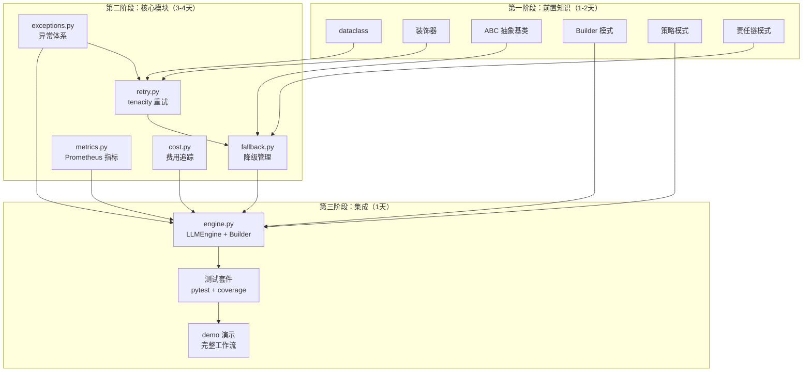

# llm_engine 学习路径规划

## 概述

本学习路径面向 `llm_engine/` 包，涵盖多模型 Fallback、重试策略、Prometheus 监控指标、费用追踪等核心模块。代码已完整实现，学习路径按依赖关系从底层到顶层编排。

## 前置信息

### 代码位置

项目采用分层包架构，`llm_engine/` 是核心编排层：

```
demo_agent/
├── llm_client/        ← 传输层（API 适配器）
├── llm_engine/        ← 编排层（重试/降级/监控/费用）★ 学习目标
├── function_caller/   ← 工具调用
├── prompts/           ← 提示词工程
├── session/           ← 会话管理
└── tests/             ← 测试
```

### 模块映射

| 学习主题 | 对应文件 | 功能 |
|---------|---------|------|
| 异常体系 | `exceptions.py` | `TransientError` vs `NonRetryableError` |
| 重试策略 | `retry.py` | tenacity 三维配置（stop/wait/retry） |
| 降级管理 | `fallback.py` | 责任链模式顺序切换客户端 |
| 监控指标 | `metrics.py` | Prometheus Counter + Histogram |
| 费用追踪 | `cost.py` | 按模型定价计算 USD 费用 |
| 统一入口 | `engine.py` | Builder 模式串联全模块 + 回调钩子 |
| 公开 API | `__init__.py` | 统一导出 11 个符号 |

---

## 第一阶段：前置知识（1-2天）

### Python 语言特性

| 概念 | 用在哪里 | 推荐资源 |
|------|---------|---------|
| `dataclass` + `field` | `RetryConfig`、`GenerationConfig` | [Python 官方 dataclass 文档](https://docs.python.org/3/library/dataclasses.html) |
| `ABC` + `abstractmethod` | `BaseLLMClient` 抽象基类 | [Python ABC 文档](https://docs.python.org/3/library/abc.html) |
| 装饰器 (`@decorator`) | `create_retry_decorator` | [Real Python 装饰器教程](https://realpython.com/primer-on-python-decorators/) |
| `contextlib` / `with` | tenacity 的 `with attempt:` | [Python 上下文管理器](https://docs.python.org/3/library/contextlib.html) |
| 类型注解 (`\| None`, `Callable`) | 全项目 | [Python typing 文档](https://docs.python.org/3/library/typing.html) |
| `__all__` 导出控制 | `__init__.py` | [Python `__all__` 说明](https://docs.python.org/3/tutorial/modules.html#importing-from-a-package) |

### 设计模式

| 模式 | 用在哪里 | 推荐资源 |
|------|---------|---------|
| **Builder** | `LLMEngineBuilder` 链式构造 | [Refactoring Guru - Builder](https://refactoring.guru/design-patterns/builder) |
| **Strategy** | `RetryConfig` 三种退避策略 | [Refactoring Guru - Strategy](https://refactoring.guru/design-patterns/strategy) |
| **Chain of Responsibility** | `FallbackManager` 顺序降级 | [Refactoring Guru - Chain of Responsibility](https://refactoring.guru/design-patterns/chain-of-responsibility) |
| **Facade** | `LLMEngine` 统一入口 | [Refactoring Guru - Facade](https://refactoring.guru/design-patterns/facade) |

---

## 第二阶段：核心模块逐个击破（3-4天）

### Day 1：异常体系 + 重试机制

**学习顺序**：`exceptions.py` → `retry.py`

#### exceptions.py（15 分钟）

阅读 `/llm_engine/exceptions.py`，理解四级异常层次：



**关键理解**：`TransientError` vs `NonRetryableError` 的语义边界决定了整个重试 + 降级系统的行为。

#### retry.py（1.5 小时）

1. 安装 tenacity：`pip install tenacity`
2. 阅读 [tenacity 官方文档](https://tenacity.readthedocs.io/en/latest/)
3. 对照阅读 `/llm_engine/retry.py`：

**RetryConfig 三维策略**：

| 维度 | 方法 | tenacity 对象 | 含义 |
|------|------|-------------|------|
| stop | `to_tenacity_stop()` | `stop_after_attempt(n)` | 最多尝试 n 次（含首次） |
| wait | `to_tenacity_wait()` | `wait_exponential` / `wait_fixed` / `wait_incrementing` | 两次重试间的等待策略 |
| retry | `build_retrying().retry` | `retry_if_exception_type(...)` | 什么异常触发重试 |

**三种退避策略的数学含义**（第 n 次重试等待时间）：

| 策略 | 公式 | 适用场景 |
|------|------|---------|
| `exponential` | `min(2^(n-1) × min_wait, max_wait)` | 速率限制 (429)，避免雪崩 |
| `fixed` | `min_wait` | 简单轮询 |
| `linear` | `min(n × min_wait, max_wait)` | 渐进式退避 |

**两种使用方式**：

| 方式 | API | 适用场景 |
|------|-----|---------|
| 编程式 | `config.build_retrying()` | 需要在循环内灵活控制 |
| 声明式 | `create_retry_decorator(config)` | 装饰任意函数，业务代码零侵入 |

4. 运行测试验证理解：`pytest tests/test_retry.py -v`

**动手练习**：
```python
from tenacity import retry, stop_after_attempt, wait_fixed
import random

@retry(stop=stop_after_attempt(3), wait=wait_fixed(0.1))
def flaky_api_call() -> str:
    """模拟不稳定的 API 调用，演示 tenacity 自动重试。"""
    if random.random() < 0.7:
        raise ConnectionError("网络抖动")
    return "成功！"

print(flaky_api_call())
```

---

### Day 2：Fallback 降级管理

**学习顺序**：`retry.py` → `fallback.py`

#### fallback.py（2 小时）

阅读 `/llm_engine/fallback.py`，理解执行流程：



**关键设计决策**：

1. **NonRetryableError 不降级**：认证失败（401）、余额不足（402）等问题换模型也无法解决，直接向上抛出是正确行为。

2. **回调钩子设计**：`execute_with_callbacks` 提供三个扩展点：
   - `on_success(client, response, attempts)` — 记录指标和费用
   - `on_failure(client, error, attempts)` — 记录错误日志
   - `on_switch(from, to, reason)` — 降级切换告警

3. **敏感信息脱敏**：`_sanitize_error_message` 对 `sk-...` 格式的 API Key 和 Bearer Token 进行正则替换，防止泄露到日志。

4. **每个客户端独立重试**：每个模型内部使用独立的 `Retrying` 对象，不会跨模型累积重试次数。

运行测试：`pytest tests/test_fallback.py -v`

**动手练习**：
```python
from llm_engine.fallback import FallbackManager
from llm_engine.retry import RetryConfig
from llm_engine.exceptions import TransientError
from unittest.mock import MagicMock

# 创建 mock 客户端，主模型失败、备用成功
primary = MagicMock()
primary.model_name = "gpt-4o"
primary.chat_completion.side_effect = TransientError("timeout")

backup = MagicMock()
backup.model_name = "deepseek-chat"
backup.chat_completion.return_value = {"content": "降级成功"}

fm = FallbackManager([primary, backup], RetryConfig(max_attempts=2))
result = fm.execute([{"role": "user", "content": "hello"}])
print(result["content"])  # "降级成功"
```

---

### Day 3：监控指标 + 费用追踪

**学习顺序**：`metrics.py` + `cost.py`（独立模块，无相互依赖）

#### metrics.py（1.5 小时）

1. 安装 prometheus_client：`pip install prometheus-client`
2. 阅读 [prometheus_client 文档](https://github.com/prometheus/client_python)
3. 对照阅读 `/llm_engine/metrics.py`：

**三类 Prometheus 指标**：

| 指标名称 | 类型 | Labels | 含义 |
|---------|------|--------|------|
| `llm_call_total` | Counter | `model`, `status` | 按模型和成功/失败统计调用次数 |
| `llm_token_usage_total` | Counter | `model`, `type` | 按模型和 prompt/completion/total 统计 token 用量 |
| `llm_latency_seconds` | Histogram | `model` | 按模型统计调用延迟分布 |

**标签基数爆炸防护**：
```python
_KNOWN_MODELS = frozenset({"gpt-4o", "gpt-4o-mini", "deepseek-chat", "deepseek-reasoner"})
_UNKNOWN_MODEL_LABEL = "unknown"
```
不在白名单中的模型名称归入 `"unknown"` 标签，防止 Prometheus 时间序列膨胀。

**类级别共享指标**：
```python
_call_total: Counter | None = None  # 类属性，所有实例共享
```
避免重复注册同一名称的指标到 Prometheus 注册表。

4. 运行测试：`pytest tests/test_metrics.py -v`

#### cost.py（1 小时）

阅读 `/llm_engine/cost.py`：

**定价表设计**：

```python
PRICING: dict[str, dict[str, float]] = {
    "gpt-4o":           {"prompt": 2.50,  "completion": 10.00},  # USD/1M tokens
    "gpt-4o-mini":      {"prompt": 0.15,  "completion": 0.60},
    "deepseek-chat":    {"prompt": 0.14,  "completion": 0.28},
    "deepseek-reasoner":{"prompt": 0.55,  "completion": 2.19},
}
```

**费用计算公式**：
```
cost = prompt_tokens / 1,000,000 × prompt_price
     + completion_tokens / 1,000,000 × completion_price
```

**关键设计决策**：
- 未知模型返回 `0.0` + warning 日志（不抛异常，不阻塞业务流程）
- `get_summary()` 返回 `{total_cost, call_count, by_model}` 字典
- `cost_by_model` 属性返回防御性副本（`dict(self._cost_by_model)`）

运行测试：`pytest tests/test_cost.py -v`

**动手练习**：
```python
from llm_engine.cost import CostTracker

tracker = CostTracker()
# 模拟多次调用
tracker.record_call("gpt-4o", {"prompt_tokens": 1500, "completion_tokens": 800})
tracker.record_call("deepseek-chat", {"prompt_tokens": 2000, "completion_tokens": 500})

summary = tracker.get_summary()
print(f"总费用: ${summary['total_cost']:.6f}")
print(f"调用次数: {summary['call_count']}")
for model, cost in summary['by_model'].items():
    print(f"  {model}: ${cost:.6f}")
```

**成本对比练习**：用 `calculate_cost` 比较不同模型的费用差异。

---

### Day 4：LLMEngine 统一入口 + Builder 模式

**学习顺序**：将前面所有模块串联到 `engine.py`

#### engine.py（2 小时）

阅读 `/llm_engine/engine.py`：

**架构全景**：



**回调钩子如何串联各模块**：

```python
def on_failure(client, error, attempt_count):
    attempts[0] += 1                          # 累计尝试次数
    self._metrics.record_call(                # 记录失败指标
        model=client.model_name, tokens={},
        latency_ms=0.0, success=False)

def on_success(client, response, attempt_count):
    attempts[0] += 1
    captured_client[0] = client
    self._metrics.record_call(...)            # 记录成功指标
    self._cost_tracker.record_call(...)        # 记录费用
```

**为什么用 Builder 模式**：

| 问题 | Builder 方案 |
|------|-------------|
| 5 个可选参数，构造函数签名过长 | 链式 API：`.primary().add_fallback().with_retry().with_metrics().build()` |
| Prometheus 指标需全局唯一 | 延迟实例化：`with_metrics()` 仅标记，`build()` 时才创建 |
| 需要默认值但不想耦合 | Builder 内部处理所有默认逻辑 |

**标准化响应字典**（7 个字段）：

```python
{
    "content": str,        # 模型回复文本
    "model": str,          # 实际使用的模型名称
    "usage": dict,         # Token 用量 {prompt_tokens, completion_tokens, total_tokens}
    "attempts": int,       # 总尝试次数（含重试和降级切换）
    "cost": float,         # 本次调用费用（USD）
    "finish_reason": str,  # 完成原因（stop/length/...）
    "raw_response": dict,  # 客户端原始返回的完整字典
}
```

运行测试：`pytest tests/test_engine.py -v`

**动手练习**：
```python
from llm_engine import LLMEngine
from unittest.mock import MagicMock

primary = MagicMock()
primary.model_name = "gpt-4o"
primary.chat_completion.return_value = {
    "content": "Hello!",
    "model": "gpt-4o",
    "usage": {"prompt_tokens": 100, "completion_tokens": 50, "total_tokens": 150},
    "finish_reason": "stop",
}

engine = (
    LLMEngine.builder()
    .primary(primary)
    .with_retry(max_attempts=3, backoff="exponential")
    .with_metrics()
    .with_cost_tracking()
    .build()
)

response = engine.chat([{"role": "user", "content": "Hi"}])
print(response["content"])
print(f"费用: ${response['cost']:.6f}, 尝试次数: {response['attempts']}")
```

---

## 第三阶段：测试与集成（1天）

### Day 5：运行演示 + 阅读测试

#### 运行完整 Demo

```bash
python examples/llm_engine_demo.py
```

打开 `http://localhost:9090/metrics` 查看 Prometheus 指标。Demo 展示四个场景：
1. 直接构造 LLMEngine
2. Builder 模式构造
3. Fallback + Retry 完整流程（重试成功 + 降级切换）
4. Prometheus Metrics HTTP 端点

#### 阅读测试代码（测试即文档）

| 测试文件 | 覆盖内容 | 关键学习点 |
|---------|---------|-----------|
| `tests/test_retry.py` | 默认值、自定义配置、三种退避策略、非法 backoff、装饰器行为、实际重试/不重试/上限 | `retry_if_exception_type` 谓词 |
| `tests/test_fallback.py` | 空列表校验、主成功、主失败备成功、全失败、NonRetryableError 阻断、多备用、回调触发 | 责任链的正确性验证 |
| `tests/test_metrics.py` | 成功记录、失败记录、token 缺失默认、累加、重置后再次记录 | Prometheus Counter 累加语义 |
| `tests/test_cost.py` | 四种模型计算、零 token、未知模型、累加、分组、防御性副本、重置 | `pytest.approx` 浮点比较 |
| `tests/test_engine.py` | 集成测试：完整流程、Builder 模式、异常传播 | 各模块协作验证 |

#### 运行全部测试

```bash
python -m pytest tests/ -v --cov=llm_engine --cov-report=term-missing
```

---

## 学习架构图



---

## 学习检查清单

- [ ] 理解 `TransientError` vs `NonRetryableError` 的语义边界
- [ ] 能说出三种退避策略（exponential/fixed/linear）的数学差异
- [ ] 能独立写一个 tenacity 重试装饰器
- [ ] 理解 `FallbackManager` 的责任链执行流程
- [ ] 能解释为什么 `NonRetryableError` 不触发降级切换
- [ ] 理解 Prometheus Counter vs Histogram 的使用场景
- [ ] 知道标签基数爆炸问题及白名单防护方案
- [ ] 能手算一次 gpt-4o 调用的费用
- [ ] 理解 Builder 模式相对于多参数构造函数的优势
- [ ] 能运行完整测试套件并解释覆盖率报告
- [ ] 成功运行 `llm_engine_demo.py` 并访问 `/metrics` 端点

---

## 进阶扩展方向

| 主题 | 方向 | 参考 |
|------|------|------|
| 完整熔断器 | 基于 `circuitbreaker` 库实现三态熔断器（Closed/Half-Open/Open） | [circuitbreaker PyPI](https://pypi.org/project/circuitbreaker/) |
| 真实 Prometheus + Grafana | 搭建监控仪表盘，配置告警规则 | [Prometheus Python Client](https://prometheus.io/docs/instrumenting/clientlibs/) |
| 流式 Fallback | `LLMEngine.stream()` 目前抛出 `NotImplementedError`，需实现 SSE 流式降级 | SSE 协议 + AsyncGenerator |
| 成本预估 | 在调用前根据 `max_tokens` 预估最大费用，支持预算控制 | 参考 `CostTracker.calculate_cost` |
| 多 Provider 扩展 | 添加 Anthropic Claude、Google Gemini 到 `PRICING` 和 `_KNOWN_MODELS` | 参考 `llm_client/` 的适配器模式 |
| 智能路由 | 根据 prompt 复杂度、优先级自动选择最优模型 | 参考 `llm_client/router.py` |


## Related Files

- `llm_engine/exceptions.py`
- `llm_engine/retry.py`
- `llm_engine/fallback.py`
- `llm_engine/metrics.py`
- `llm_engine/cost.py`
- `llm_engine/engine.py`
- `llm_engine/__init__.py`
- `examples/llm_engine_demo.py`
