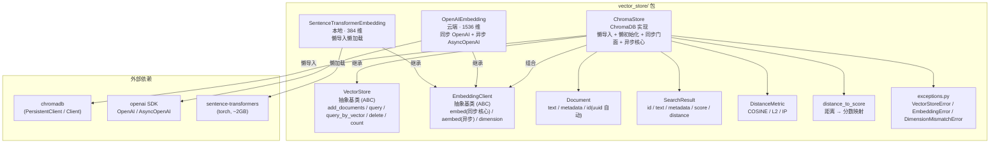

# Feature: Vector Store Package — `vector_store/`

## Overview

`vector_store/` 是一套**与后端无关的向量数据库抽象层**，覆盖「文本 → 向量 → 存储 → 检索」的完整链路。它把向量存储拆解为两个正交的抽象角色，并各自提供可插拔的实现：

1. **存储层** — `VectorStore` 抽象基类声明了统一契约（写入、文本检索、向量检索、删除、计数）；`ChromaStore` 是它的 ChromaDB 具体实现，通过「懒导入 + 懒初始化 + 同步门面 + 异步核心」兼顾易用性与性能。
2. **嵌入层** — `EmbeddingClient` 抽象基类声明「文本 → 向量」的最小契约；两个后端实现 `OpenAIEmbedding`（云端，`text-embedding-3-small`，1536 维，同步 + 原生异步）与 `SentenceTransformerEmbedding`（本地，`all-MiniLM-L6-v2`，384 维，懒导入懒加载以避免 torch 依赖）可无缝切换。

配合数据模型 `Document` / `SearchResult`、距离度量 `DistanceMetric`（COSINE / L2 / IP）以及异常体系 `VectorStoreError` / `EmbeddingError` / `DimensionMismatchError`，上层业务只需面向抽象编程即可替换后端。

## Architecture



## Key Components

| 组件 | 文件 | 用途 |
|------|------|------|
| `VectorStore` | `vector_store/chroma_store.py` | 存储层抽象基类，声明五个核心操作契约 |
| `ChromaStore` | `vector_store/chroma_store.py` | ChromaDB 具体实现，懒初始化 + 同步门面 + asyncio 异步核心 |
| `EmbeddingClient` | `vector_store/embeddings/base.py` | 嵌入层抽象基类，`embed` 同步为核心，`aembed` 提供默认 `asyncio.to_thread` 包装 |
| `OpenAIEmbedding` | `vector_store/embeddings/openai_embedding.py` | 云端嵌入，默认 `text-embedding-3-small`，懒创建同步/异步客户端 |
| `SentenceTransformerEmbedding` | `vector_store/embeddings/sentence_transformer.py` | 本地嵌入，默认 `all-MiniLM-L6-v2`，懒导入 + 懒加载模型 |
| `Document` / `SearchResult` | `vector_store/document.py` | 待向量化文档 / 检索命中结果的数据模型 |
| `DistanceMetric` / `distance_to_score` | `vector_store/distance.py` | 距离度量枚举 + 距离→分数映射纯函数 |
| `VectorStoreError` 等 | `vector_store/exceptions.py` | 统一异常体系，`DimensionMismatchError` 携带期望/实际维度 |

## Usage

```python
from vector_store import (
    ChromaStore,
    OpenAIEmbedding,
    SentenceTransformerEmbedding,
    Document,
    DistanceMetric,
)

# 1. 双后端切换：只需替换嵌入客户端实例
#    云端（需 OPENAI_API_KEY 环境变量，构造阶段不报错，首次请求才鉴权）
cloud_embedding = OpenAIEmbedding(model="text-embedding-3-small")
#    本地（懒加载，未装 torch 时构造也不报错，首次 embed 才触发导入）
local_embedding = SentenceTransformerEmbedding(model_name="all-MiniLM-L6-v2")

# 2. 构造存储（懒初始化：此处不导入 chromadb、不建立任何连接）
store = ChromaStore(
    embedding=local_embedding,
    collection_name="docs",
    metric=DistanceMetric.COSINE,
    # persist_directory="./chroma_data",  # 可选：提供则用持久化客户端，否则内存版
)

# 3. 构造文档（id 缺省时自动用 uuid.uuid4().hex 生成 32 位标识）
docs = [
    Document(text="向量数据库入门指南", metadata={"source": "wiki"}),
    Document(text="ChromaDB 使用教程", metadata={"source": "blog"}),
]

# 4. 批量写入（chunk_size=100 分片、concurrency=4 并发）
ids = store.add_documents(docs, chunk_size=100, concurrency=4)
print(ids)  # ['a1b2...', 'c3d4...']

# 5. 文本检索（默认 k=5，可传 where 做元数据过滤）
results = store.query("如何入门向量数据库", k=5)
for r in results:
    print(r.id, f"score={r.score:.3f}", f"distance={r.distance:.3f}", r.text)

# 6. 向量检索 / 删除 / 计数
vector = local_embedding.embed(["向量数据库"])[0]
results = store.query_by_vector(vector, k=3)
store.delete(ids)
print(store.count())  # 0
```

在已有事件循环的环境（Jupyter、FastAPI 路由内）应使用异步核心，避免 `asyncio.run` 抛 `RuntimeError`：

```python
import asyncio

async def main() -> list[str]:
    ids = await store.aadd_documents(docs, chunk_size=100, concurrency=4)
    return ids

ids = asyncio.run(main())
```

## 设计要点

### 1. 抽象层次：存储与嵌入正交解耦

- `VectorStore` 与 `EmbeddingClient` 是两个独立抽象，`ChromaStore` 通过**组合**持有任意 `EmbeddingClient`（构造时注入）。
- `EmbeddingClient` 以**同步 `embed` 为最小契约**，`aembed` 在基类提供通用默认实现（`asyncio.to_thread` 投递线程池），子类可按需覆盖为原生异步（如 `OpenAIEmbedding.aembed` 改走 `AsyncOpenAI`）。

### 2. 双后端切换

两个嵌入实现遵循同一契约（`embed`/`aembed` 输入一批文本、输出**与输入顺序严格一致**的向量列表），因此替换嵌入后端只需更换构造 `ChromaStore` 时传入的实例，存储与检索代码无需改动。两者的差异仅体现在：

| 维度 | `OpenAIEmbedding` | `SentenceTransformerEmbedding` |
|------|-------------------|-------------------------------|
| 默认模型/维度 | `text-embedding-3-small`，1536 维 | `all-MiniLM-L6-v2`，384 维 |
| 运行方式 | 云端 API（同步 + 原生异步） | 本地离线（同步 `encode`） |
| 依赖导入 | 顶部导入 `openai` | 懒导入 `sentence_transformers`（避免 torch） |

### 3. 批量插入的 asyncio 分片设计

`add_documents` 是**同步门面**，内部 `asyncio.run` 调用异步核心 `aadd_documents`：

1. 将 `documents` 按 `chunk_size`（默认 100）切片成若干分片。
2. 用 `asyncio.Semaphore(concurrency)`（默认 4）限制并发，每个分片并发执行 `_process_chunk`：调用 `embedding.aembed(chunk_texts)` 生成向量后组装 `ids/embeddings/documents/metadatas` 写入 `collection.add`。
3. 用 `asyncio.gather` 收集各分片结果，再**按输入顺序**汇总返回 id 列表。

细节：空 `metadata`（`{}`）会置为 `None` 再写入，规避 chromadb 对空 dict 的兼容问题。

### 4. 懒创建 collection 与维度校验

`ChromaStore` 全程懒初始化：`chromadb` 在 `_ensure_client` 内首次调用才 `import`；客户端与 collection 在首次真正读写时创建并缓存。`_ensure_collection` 在 `get_or_create_collection` 之后执行**维度校验**：

- 若集合中已有数据（`count() > 0`），取一条既有向量（`get(limit=1, include=["embeddings"])`），比较其长度与 `embedding.dimension`，不一致则抛 `DimensionMismatchError`，避免「先写后查」维度错配的隐蔽错误。
- 空集合跳过校验，维度由首次 `add` 决定，交由 chromadb 兜底校验。

## Limitations

- `ChromaStore` 未实现更新（update/upsert）操作，仅提供写入、检索、删除、计数。
- 同步 `add_documents` 在已有运行中事件循环的环境会抛 `RuntimeError`，需改用 `aadd_documents`。
- `SentenceTransformerEmbedding` 未覆盖 `aembed`，异步调用走基类的 `asyncio.to_thread` 线程池包装（本地模型本身为同步推理）。
- `OpenAIEmbedding` 不接受的空字符串输入（`""`）会在两个后端统一抛 `ValueError`。


## Related Files

- `vector_store/__init__.py`
- `vector_store/chroma_store.py`
- `vector_store/document.py`
- `vector_store/distance.py`
- `vector_store/exceptions.py`
- `vector_store/embeddings/base.py`
- `vector_store/embeddings/openai_embedding.py`
- `vector_store/embeddings/sentence_transformer.py`
