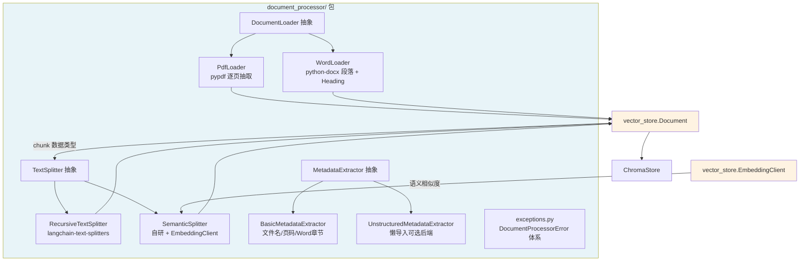
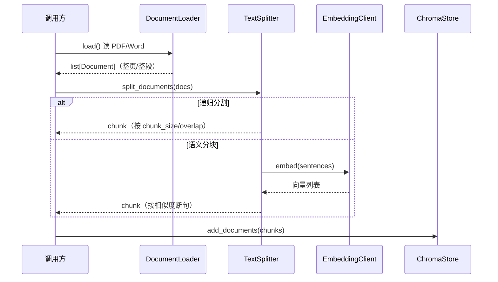

# Document Processor Package — document_processor/

## Overview

`document_processor/` 是 RAG 链路的上游处理包，负责把**原始文件（PDF/Word）转换为可供向量化的文本 chunk**，是 Day 7「文档处理与分块策略」的产出。

它在 Day 6 的 `vector_store/` 包之上补齐了「原始文件 → 文本 chunk」这一环，与既有能力形成完整 pipeline：

```
原始文件 → DocumentLoader（加载）→ TextSplitter（分块）→ ChromaStore（向量化存储）
```

核心设计原则：

- **复用而非重复**：chunk 数据类型直接复用 `vector_store.Document`（`text`/`metadata`/`id` 三字段），语义分块复用 `vector_store.embeddings.EmbeddingClient`，避免重复定义数据模型。
- **懒导入 + 轻依赖**：`pypdf`/`python-docx`/`langchain-text-splitters`/`unstructured` 等重依赖均在方法体内懒导入，仅在真正使用时才加载；其中 `unstructured` 是最重的可选后端。
- **抽象接口 + 多实现**：每个能力域（加载/分割/元数据）都定义抽象基类，支持无缝替换后端。

## Architecture



## Key Components

### 1. 加载器（`loaders/`）

| 组件 | 说明 |
|------|------|
| `DocumentLoader`（抽象） | 统一抽象契约：`load() -> list[Document]`，返回的每个 `Document.metadata` 至少含 `source` |
| `PdfLoader` | 基于 `pypdf` 逐页抽取文本，跳过空白页，`metadata` 含 `source`/`page`（0-based） |
| `WordLoader` | 基于 `python-docx` 遍历段落，追踪 Heading 样式，`metadata` 含 `source`/`paragraph_index`/`section` |

### 2. 分割器（`splitters/`）

| 组件 | 说明 |
|------|------|
| `TextSplitter`（抽象） | 抽象 `split_text` + 模板方法 `split_documents`（metadata 透传 + 追加 `chunk_index`） |
| `RecursiveTextSplitter` | 委托 `langchain-text-splitters`，参数 `chunk_size`/`chunk_overlap`/`separators`，默认中英混合分隔符 |
| `SemanticSplitter` | 自研语义分块：按句切分 → 批量 embedding → 相邻余弦相似度 → 阈值断句，注入 `EmbeddingClient` |

### 3. 元数据提取（`metadata/`）

| 组件 | 说明 |
|------|------|
| `MetadataExtractor`（抽象） | 抽象契约：`extract(path) -> dict[str, Any]` |
| `BasicMetadataExtractor` | 提取 `filename`/`file_type`/`size`/`modified_time`，PDF 追加 `page_count`，docx 追加 `sections`（保序去重） |
| `UnstructuredMetadataExtractor` | 懒导入 `unstructured` 的可选后端，提取标题/章节/页码/元素统计 |

### 4. 异常体系（`exceptions.py`）

`DocumentProcessorError`（基类）→ `DocumentLoadError` / `DocumentSplitError` / `MetadataExtractionError`。

## Usage

```python
from document_processor import PdfLoader, RecursiveTextSplitter, BasicMetadataExtractor, SemanticSplitter
from vector_store import ChromaStore
from vector_store.embeddings import SentenceTransformerEmbedding

# 1. 加载
loader = PdfLoader("docs/paper.pdf")
documents = loader.load()  # list[Document]，每页一个，metadata 含 source/page

# 2. 元数据提取
extractor = BasicMetadataExtractor()
meta = extractor.extract("docs/paper.pdf")  # 含 page_count 等

# 3. 分块（递归分割）
splitter = RecursiveTextSplitter(chunk_size=1000, chunk_overlap=200)
chunks = splitter.split_documents(documents)  # 保留 metadata，追加 chunk_index

# 4. 语义分块（复用嵌入客户端）
semantic = SemanticSplitter(
    embedding=SentenceTransformerEmbedding(model_name="all-MiniLM-L6-v2"),
    breakpoint_threshold=0.5,
)
semantic_chunks = semantic.split_documents(documents)

# 5. 写入向量库
store = ChromaStore(embedding=SentenceTransformerEmbedding(...))
store.add_documents(chunks)
```

## Data Flow



## A/B 实验（`examples/chunking_ab_test.py`）

脚本对比不同 `chunk_size`/`chunk_overlap` 组合的自监督召回率，matplotlib 输出召回率曲线。

**关键观察**（基于确定性哈希 `HashEmbedding`）：`chunk_size=50`（单句分块）时 query 向量与 chunk 向量逐字相等，命中率 1.0；`chunk_size` 增大后，因哈希雪崩效应（文本只差一字向量即完全不同）+ 检索近似随机，命中率 ≈ `k / chunk_count`，呈现「单句 1.0 悬崖 → 多句区间低位抬升」的曲线。这揭示了**确定性哈希嵌入无法支撑语义检索**，语义分块与语义召回需真实 embedding。

## Key Decisions

1. **复用 `vector_store.Document` 与 `EmbeddingClient`** —— 形成无缝 pipeline，避免重复数据模型。
2. **PDF 用 `pypdf` 直连而非 `langchain-community` 的 `PyPDFLoader`** —— `PyPDFLoader` 本质是 `pypdf` 的薄封装，而 `langchain-community` 依赖树过重，接口抽象后只改实现即可。
3. **语义分块自研（复用 `EmbeddingClient`）而非引入 llama-index** —— 避免重依赖 + 双向适配，算法透明可控。
4. **`unstructured` 作为懒导入可选后端** —— 它是最重依赖（系统级 libmagic/poppler/tesseract），默认用 `BasicMetadataExtractor`。

## Related Files

- `document_processor/__init__.py`
- `document_processor/exceptions.py`
- `document_processor/loaders/base.py`
- `document_processor/loaders/pdf_loader.py`
- `document_processor/loaders/word_loader.py`
- `document_processor/splitters/base.py`
- `document_processor/splitters/recursive.py`
- `document_processor/splitters/semantic.py`
- `document_processor/metadata/base.py`
- `document_processor/metadata/basic.py`
- `document_processor/metadata/unstructured_extractor.py`
- `examples/chunking_ab_test.py`
