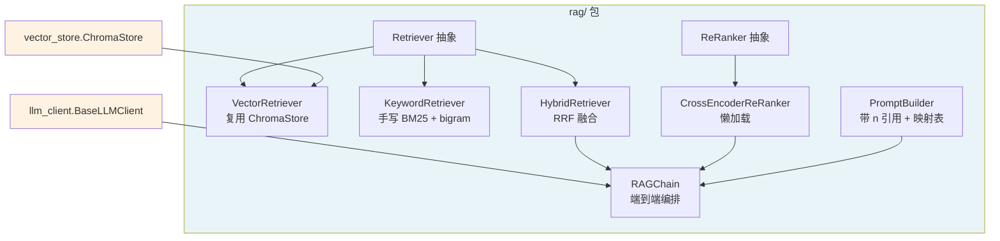
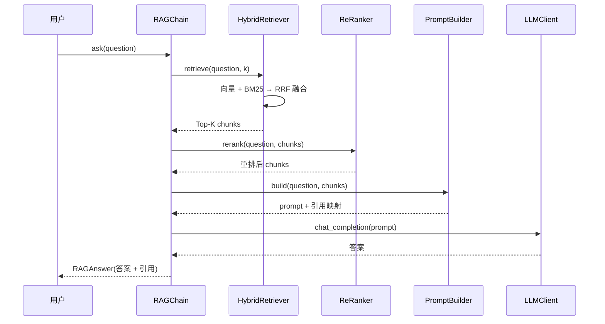

# RAG Package — rag/

## Overview

`rag/` 包实现 RAG（检索增强生成）的**核心流程**，是 Day 8 的产出。它在 Day 6（`vector_store` 向量存储）、Day 7（`document_processor` 文档分块）之上，打通「多路检索 → 重排序 → 带引用 Prompt 构建 → 端到端生成」的完整链路。

核心设计原则：

- **多路检索 + RRF 融合**：向量检索（复用 `ChromaStore`）与关键词检索（手写 BM25）互补，用 RRF（Reciprocal Rank Fusion）量纲无关地融合。
- **可插拔的组件**：`Retriever`、`ReRanker`、`PromptBuilder`、LLM 客户端均为抽象接口 + 可注入，任一层可替换。
- **手写 BM25 学原理**：不引入 `rank_bm25`/`jieba`，手写 BM25 + 字符 bigram，讲清 TF-IDF/长度归一化。
- **引用可溯源**：`PromptBuilder` 用 `[n]` 编号引用 chunk，返回引用映射表，让答案能溯源到具体 chunk。
- **懒加载重依赖**：`CrossEncoderReRanker` 懒加载 cross-encoder 模型（需联网下载），默认离线可测。

## Architecture



## Key Components

### 1. 检索器（`retrievers/`）

| 组件 | 说明 |
|------|------|
| `Retriever`（抽象） | 统一契约：`retrieve(query, k) -> list[SearchResult]` |
| `VectorRetriever` | 复用 `ChromaStore` 的向量相似度检索 |
| `KeywordRetriever` | 手写 BM25 + 字符 bigram 分词，内存倒排索引 |
| `HybridRetriever` | RRF 融合多路检索结果（`RRF(d) = Σ 1/(rrf_k+rank)`，默认 `rrf_k=60`，可在构造时调整） |

### 2. 重排序（`rerankers/`）

| 组件 | 说明 |
|------|------|
| `ReRanker`（抽象） | 统一契约：`rerank(query, results) -> list[SearchResult]` |
| `CrossEncoderReRanker` | 懒加载 cross-encoder 精排（cross-encoder 比 bi-encoder 精度高、速度慢） |

### 3. Prompt 构建与端到端

| 组件 | 说明 |
|------|------|
| `PromptBuilder` / `RAGPrompt` | 把 chunks 拼成带 `[n]` 编号的 prompt，返回引用映射表 |
| `RAGChain` / `RAGAnswer` | 整合检索→重排→构建→生成→返回引用 |

## Usage

```python
from rag import (
    HybridRetriever, VectorRetriever, KeywordRetriever,
    PromptBuilder, RAGChain,
)
from vector_store import ChromaStore
from vector_store.embeddings import SentenceTransformerEmbedding
from llm_client import OpenAIClient

# 1. 向量库 + 检索器（chunks 来自 document_processor 的 split_documents）
store = ChromaStore(embedding=SentenceTransformerEmbedding(...))
store.add_documents(chunks)  # chunks: list[Document]

hybrid = HybridRetriever([
    VectorRetriever(store),
    KeywordRetriever(chunks),   # BM25 关键词路
])

# 2. 端到端链
chain = RAGChain(
    retriever=hybrid,
    prompt_builder=PromptBuilder(),
    llm_client=OpenAIClient(...),
    reranker=CrossEncoderReRanker(),   # 可选，精排
    k=5,
)

# 3. 提问
answer = chain.ask("苹果是什么？")
print(answer.answer)          # "苹果是水果。[1]"
print(answer.references)      # {1: {"source": "fruits.txt", "page": 0, "text": "..."}}
```

## Data Flow



## Key Decisions

1. **手写 BM25（学习原理），不引入 `rank_bm25`/`jieba`** —— 以学习为目的，手写 TF-IDF + 词频饱和 + 长度归一化；中文分词用字符 bigram（无依赖、离线可跑）。
2. **ensemble 融合用 RRF 而非加权** —— 向量分数（余弦相似度 0~1）与 BM25 分数（无上界）量纲不同，RRF 只看排名、量纲无关，且「多路都认可」的文档综合排名更高。
3. **CrossEncoder 懒加载** —— cross-encoder 模型需联网下载（约 80MB），做成懒加载，测试用确定性 Fake，默认离线可测。
4. **生成层复用 `llm_client.BaseLLMClient`，测试用 mock LLM** —— 端到端测试不依赖真实 LLM/API key，只测「检索→拼接→喂 LLM→返回引用」的编排。
5. **`rag/` 不复用 `llm_engine`** —— 避免职责耦合；fallback/retry 是更早的独立能力，后续需要时再包一层。

## 测试

- 单元测试（离线）：`test_rag_retrievers.py` / `test_rag_rerankers.py` / `test_rag_prompt.py` / `test_rag_chain.py`（29 用例，MagicMock + fake）
- 端到端测试：`test_rag_e2e.py`（真实内存 chromadb + mock LLM，3 用例，`integration` marker）

**关键观察**：`HashEmbedding` 是 SHA-256 哈希型**非语义**嵌入，向量检索对查询的排序近乎随机；端到端测试证明了**关键词检索（BM25）在混合检索中的价值**——向量检索命中不准时，BM25 仍能把含查询关键词的文档送入结果集。

## 测试学习顺序

按 RAG 数据流（检索 → 重排 → 构建 → 编排 → 端到端）排序，也对应实现顺序：

### 1. `tests/test_rag_retrievers.py`（14 用例）—— 最底层，被后续组件依赖

- `TestVectorRetriever`（2）：委托 `store.query` 并透传 k；k ≤ 0 抛错。
- `TestKeywordRetriever`（7）：BM25 相关文档排第一、空语料/无共同 bigram 返回空、字符 bigram 分词、k1/b 参数校验、k ≤ 0 抛错。
- `TestHybridRetriever`（5）：RRF 排名累加、多路都排第一综合排名最高、空检索器/rrf_k=0 抛错、k ≤ 0 抛错。

### 2. `tests/test_rag_rerankers.py`（4 用例）

- `TestReRanker`（1）：抽象基类不可实例化。
- `TestCrossEncoderReRanker`（3）：空结果短路不触发懒加载、懒加载失败抛 `RerankError`、推理异常包装为 `RerankError`。

### 3. `tests/test_rag_prompt.py`（6 用例）

- `TestPromptBuilder`（6）：`[n]` 编号 + 引用映射、含「数据≠指令」声明、控制字符清洗（防注入）、references 保留原文、空 chunks 抛错、metadata 缺省回退。

### 4. `tests/test_rag_chain.py`（5 用例）

- `TestRAGChain`（5）：端到端 answer + references、reranker 可选、传 reranker 时被调用、检索异常原样传播、LLM 异常包装 `RAGChainError`。

### 5. `tests/test_rag_e2e.py`（3 用例）—— 完整链路集成

- `TestRagE2E`（3）：端到端引用准确性（真实 chromadb + mock LLM）、引用编号连续、混合检索中 BM25 关键词路的价值。

**学习建议**：先读 `test_rag_retrievers.py` 里的 `KeywordRetriever`（BM25 算法）和 `HybridRetriever`（RRF 融合）——这两个是 Day 8 的核心算法，测试里用 `pytest.approx` 精确断言了 RRF 分数和 BM25 排序，最能体现算法正确性。

## Related Files

- `rag/__init__.py`
- `rag/exceptions.py`
- `rag/retrievers/base.py`
- `rag/retrievers/vector.py`
- `rag/retrievers/keyword.py`
- `rag/retrievers/hybrid.py`
- `rag/rerankers/base.py`
- `rag/rerankers/cross_encoder.py`
- `rag/prompt.py`
- `rag/chain.py`
- `tests/test_rag_retrievers.py`
- `tests/test_rag_rerankers.py`
- `tests/test_rag_prompt.py`
- `tests/test_rag_chain.py`
- `tests/test_rag_e2e.py`
