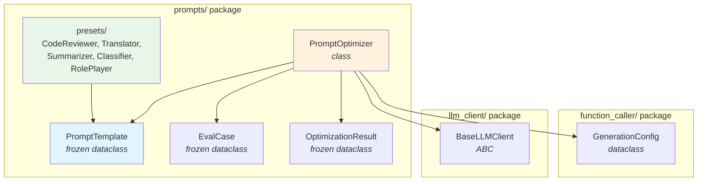
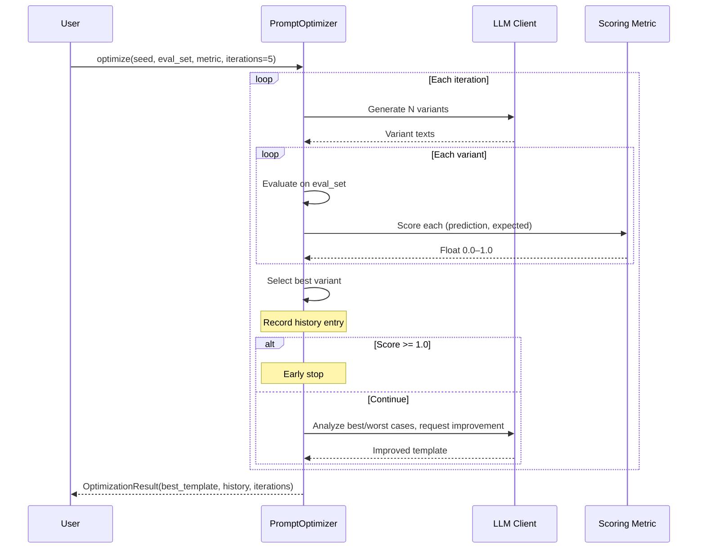

# Feature: Prompt Engineering Package — `prompts/`

## Overview

The `prompts/` package provides a comprehensive prompt engineering toolkit for LLM-powered applications. It sits alongside the `function_caller/` package in the project and offers three core capabilities:

1. **Immutable Template Engine** — `PromptTemplate` frozen dataclass with `{{ var }}` syntax, built-in escape support (`\{` → `{`), version tracking, and fluent `with_var()` API for gradual variable binding.
2. **System Prompt Presets** — Five production-ready system prompt templates (`CodeReviewer`, `Translator`, `Summarizer`, `Classifier`, `RolePlayer`) with sensible defaults, rich metadata, and multi-variable placeholder support.
3. **Iterative Prompt Optimizer** — DSPy-inspired `PromptOptimizer` that uses LLM self-evaluation to generate variants, score them against an eval set, analyze best/worst cases, and iteratively improve prompt quality.

The `PromptTemplate` core is pure Python with zero external dependencies — only the standard library's `dataclasses` and `re` modules are used.

## Architecture



### Dependency Relationships

| Direction | What | Why |
|-----------|------|-----|
| `prompts/` → `llm_client/` | `BaseLLMClient` | Optimizer calls `client.chat_completion()` to generate variants and request improvements |
| `prompts/` → `function_caller/` | `GenerationConfig` | Optimizer uses `GenerationConfig.code()` preset for deterministic LLM sampling |
| `prompts/presets/` → `prompts/template.py` | `PromptTemplate` | All presets are `PromptTemplate` instances |
| `prompts/optimizer.py` → `prompts/template.py` | `PromptTemplate`, `EvalCase`, `OptimizationResult` | Optimizer's core data model |
| External → `prompts/` | None required for `template.py` | `PromptTemplate` is zero-dependency; optimizer needs LLM client |

## Key Components

| Component | File | Purpose |
|-----------|------|---------|
| `PromptTemplate` | `prompts/template.py` | Immutable template engine with `{{ var }}` syntax, escape support, and version management |
| `PromptOptimizer` | `prompts/optimizer.py` | Iterative LLM-driven prompt optimization with eval-set scoring |
| `EvalCase` | `prompts/optimizer.py` | Frozen dataclass representing a single input-expected pair for evaluation |
| `OptimizationResult` | `prompts/optimizer.py` | Frozen dataclass holding the best template, iteration history, and iteration count |
| `CodeReviewer` | `prompts/presets/code_review.py` | System prompt for multi-dimensional code review (correctness, security, performance, maintainability, testability) |
| `Translator` | `prompts/presets/translator.py` | System prompt for accurate, fluent, culturally-adapted translation |
| `Summarizer` | `prompts/presets/summarizer.py` | System prompt for structured content summarization with audience awareness |
| `Classifier` | `prompts/presets/classifier.py` | System prompt for multi-label text classification with JSON output |
| `RolePlayer` | `prompts/presets/roleplay.py` | System prompt for immersive role-playing with persona, knowledge boundary, and scenario support |

## Usage

### Basic Template Rendering

```python
from prompts import PromptTemplate

# Create a template
tpl = PromptTemplate("You are a {{ role }}. Help with {{ task }}.")

# Render with variables
result = tpl.render(role="Python expert", task="debugging")
print(result)
# "You are a Python expert. Help with debugging."
```

### Gradual Variable Binding (Immutable Pattern)

```python
from prompts import PromptTemplate

tpl = PromptTemplate("Review {{ language }} code for {{ focus }}.")

# Bind variables incrementally — each call returns a NEW instance
tpl_v2 = tpl.with_var("language", "Python")
tpl_v3 = tpl_v2.with_var("focus", "security")

print(tpl.version)      # 1 — original unchanged
print(tpl_v3.version)   # 3

result = tpl_v3.render()
# "Review Python code for security."
```

### Escape Support

```python
tpl = PromptTemplate(r"Write: \{ {{ var }}")
result = tpl.render(var="hello")
print(result)
# "Write: { hello"
```

### Missing Variable Detection

```python
tpl = PromptTemplate("Hello {{ name }}, your task is {{ task }}.")
# Raises ValueError: "缺少变量: task, name"
tpl.render()
```

### Using Presets

```python
from prompts.presets import CodeReviewer, Translator, ALL_PRESETS

# Use preset with defaults
prompt = CodeReviewer.render()
# "你是一位资深的 Python 代码审查专家..."

# Override specific variables
prompt = CodeReviewer.with_var("language", "Go").render()

# Iterate all presets
for preset in ALL_PRESETS:
    print(f"Preset: {preset.metadata['description']}")
```

### Prompt Optimization

```python
from prompts import PromptTemplate, PromptOptimizer, EvalCase

# Define evaluation set
eval_set = [
    EvalCase(input="What is 2+2?", expected="4"),
    EvalCase(input="Capital of France?", expected="Paris"),
]

# Define scoring metric
def exact_match(prediction: str, expected: str) -> float:
    return 1.0 if expected.lower() in prediction.lower() else 0.0

# Create seed template
seed = PromptTemplate("Answer: {{ text }}")

# Optimize
optimizer = PromptOptimizer(client)
result = optimizer.optimize(
    seed_template=seed,
    eval_set=eval_set,
    metric=exact_match,
    iterations=5,
    variants_per_iter=3,
)

print(f"Best template: {result.best_template.template_str}")
print(f"History entries: {len(result.history)}")
print(f"Iterations run: {result.iterations}")
```

### OptimizationResult Structure

Each history entry is a dict:

```python
{
    "iteration": 1,
    "variants": [
        {"text": "Variant text 1", "score": 0.85},
        {"text": "Variant text 2", "score": 0.92},
        {"text": "Variant text 3", "score": 0.78},
    ],
    "best_variant_idx": 1,
    "best_score": 0.92,
}
```

## Optimization Pipeline



## Presets Overview

| Preset | Variables | Default |
|--------|-----------|---------|
| `CodeReviewer` | `language`, `focus`, `style` | Python / 代码质量和安全性 / 详细 |
| `Translator` | `source_lang`, `target_lang`, `tone` | 中文 / English / 正式 |
| `Summarizer` | `format`, `max_length`, `audience` | bullet / 200字 / 技术人员 |
| `Classifier` | `categories`, `input_format` | 技术支持, 销售咨询, 投诉 / json |
| `RolePlayer` | `role_name`, `persona`, `scenario` | Python 专家 / 10年经验 / 代码咨询 |

All presets are `PromptTemplate` instances with `_bound_vars` pre-set to their defaults, so calling `.render()` without arguments yields a ready-to-use system prompt.

## Configuration

`PromptOptimizer` accepts a `GenerationConfig` instance (defaults to `GenerationConfig.code()` — temperature=0.0, top_p=0.1 for deterministic output). Override for creative prompt generation:

```python
optimizer = PromptOptimizer(
    client=my_client,
    config=GenerationConfig(temperature=1.0, top_p=0.95),
)
```

## Limitations

- **Optimizer requires LLM client** — `PromptOptimizer` depends on an external `BaseLLMClient` implementation. `PromptTemplate` itself has no such dependency.
- **Single-metric optimization** — The optimizer currently uses a single scoring function; multi-objective optimization (e.g., speed vs. accuracy) is not supported.
- **Text-only templates** — `PromptTemplate` handles plain text templates. Multi-modal content (images, audio) or chat message arrays are not supported.
- **No caching** — Repeated renders with the same variables recompute every time. Template rendering is cheap but not memoized.
- **Optimizer convergence not guaranteed** — The LLM-driven improvement step relies on the model's ability to analyze and improve prompts. Stagnation or regression is possible.
