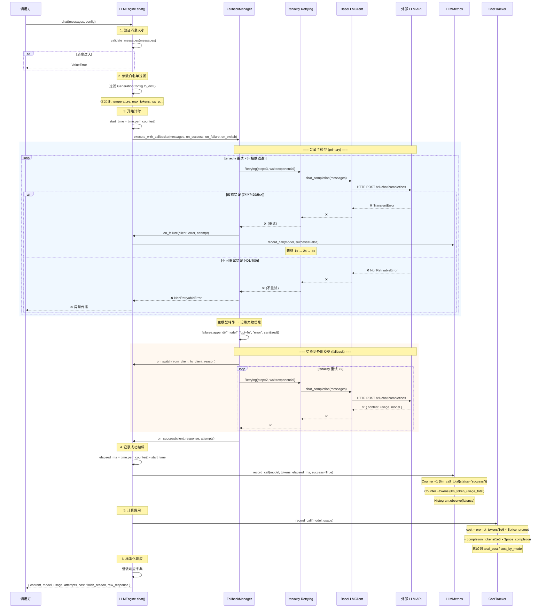

# LLM Engine 调用全链路流程

## Overview

本文档描述 `llm_engine` 包从 `LLMEngine.chat()` 被调用到返回标准化响应的完整数据流，涵盖 Fallback、Retry、Metrics、Cost Tracking 四大横切关注点如何在一次请求中协同工作。

## Flow Diagram



## Flow Steps

### Step 1: 入口验证

```python
def chat(self, messages: list[dict], config: GenerationConfig | None = None, **kwargs) -> dict:
    self._validate_messages(messages)  # 检查消息数量和总大小
```

- 消息列表不能为空
- 消息数量不超过 100 条
- 消息总大小不超过 1MB（JSON 序列化后）

### Step 2: 参数白名单过滤

```python
_ALLOWED_GENERATION_PARAMS = frozenset({
    "temperature", "max_tokens", "top_p", "frequency_penalty", "presence_penalty", "stop",
})
```

`GenerationConfig.to_dict()` 返回的字典中，只有白名单内的键会被传递给下游客户端，防止参数注入。

### Step 3: 计时开始

```python
start_time = time.perf_counter()
```

使用 `perf_counter()` 高精度计时，为延迟指标提供数据源。

### Step 4: Fallback 执行（含回调）

`FallbackManager.execute_with_callbacks()` 的核心流程：

| 阶段 | 行为 | 回调 |
|------|------|------|
| 尝试客户端 | 对当前客户端创建 `tenacity.Retrying` 对象 | - |
| 单次调用失败 | 如果异常属于 `retryable_exceptions`，tenacity 自动重试 | `on_failure(client, error, attempt)` |
| 客户端耗尽 | 所有重试次数用完，记录失败信息到 `_failures` | `on_switch(from_client, to_client, reason)` |
| 切换客户端 | 从 `_clients` 列表取下一个 | `on_switch(from_client, to_client, reason)` |
| 调用成功 | 返回 response | `on_success(client, response, attempts)` |
| 全部耗尽 | 抛出 `AllModelsExhaustedError(failed_models=...)` | - |

### Step 5: 指标记录

**成功调用**：
```python
metrics.record_call(
    model=safe_model,         # 白名单规范化后的模型名
    tokens=response["usage"], # {prompt_tokens, completion_tokens, total_tokens}
    latency_ms=elapsed_ms,    # 实际耗时
    success=True,
)
```

更新：

| 指标 | 类型 | Labels | 值 |
|------|------|--------|-----|
| `llm_call_total` | Counter | `model`, `status="success"` | +1 |
| `llm_token_usage_total` | Counter | `model`, `type="prompt"` | +prompt_tokens |
| `llm_token_usage_total` | Counter | `model`, `type="completion"` | +completion_tokens |
| `llm_token_usage_total` | Counter | `model`, `type="total"` | +total_tokens |
| `llm_latency_seconds` | Histogram | `model` | observe(latency) |

**失败调用**：
```python
metrics.record_call(model=safe_model, tokens={}, latency_ms=0.0, success=False)
```

| 指标 | 类型 | Labels | 值 |
|------|------|--------|-----|
| `llm_call_total` | Counter | `model`, `status="error"` | +1 |

> 注意：失败时不记录 token 用量和延迟（因为没拿到有效 token 数据）。

### Step 6: 费用计算

```python
cost = cost_tracker.record_call(response["model"], response["usage"])
```

| 模型 | Prompt (USD/1M tokens) | Completion (USD/1M tokens) |
|------|----------------------|---------------------------|
| gpt-4o | $2.50 | $10.00 |
| gpt-4o-mini | $0.15 | $0.60 |
| deepseek-chat | $0.14 | $0.28 |
| deepseek-reasoner | $0.55 | $2.19 |

未知模型 → 返回 $0.00 + warning 日志。

### Step 7: 标准化响应

```python
return {
    "content": response.get("content", ""),
    "model": response.get("model", "unknown"),
    "usage": response.get("usage", {}),
    "attempts": attempts[0],
    "cost": captured_cost[0],
    "finish_reason": response.get("finish_reason", "unknown"),
    "raw_response": response,
}
```

## Error Paths

```mermaid
graph TD
    A[chat() 调用] --> B{消息验证}
    B -->|失败| C[ValueError]
    B -->|通过| D[FallbackManager.execute]
    D --> E{单次调用}
    E -->|NonRetryableError| F[立即向上传播]
    E -->|TransientError| G{重试次数剩余?}
    G -->|是| H[指数退避后重试]
    H --> E
    G -->|否| I{还有备用模型?}
    I -->|是| J[on_switch → 切换模型]
    J --> E
    I -->|否| K[AllModelsExhaustedError]
    E -->|成功| L[记录 metrics + cost]
    L --> M[返回标准化响应]
```

## Related Files

| 文件 | 职责 |
|------|------|
| `llm_engine/engine.py` | 统一入口、参数验证、标准化响应 |
| `llm_engine/fallback.py` | 多模型编排、回调触发 |
| `llm_engine/retry.py` | tenacity 重试配置 |
| `llm_engine/metrics.py` | Prometheus 指标收集 |
| `llm_engine/cost.py` | 费用计算与追踪 |
| `llm_engine/exceptions.py` | 异常分类体系 |


## Related Files

- `llm_engine/engine.py`
- `llm_engine/fallback.py`
- `llm_engine/retry.py`
- `llm_engine/metrics.py`
- `llm_engine/cost.py`
- `llm_engine/exceptions.py`
