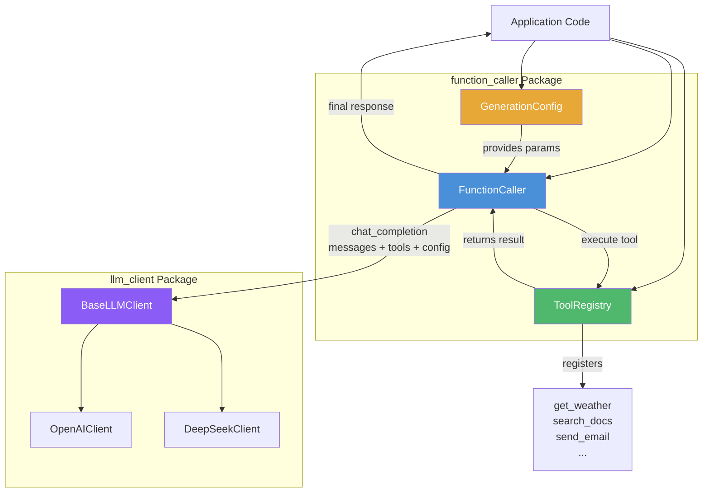

# Feature: Function Caller — LLM Tool-Calling Framework

## Overview

The **function_caller** package provides a reusable, provider-agnostic framework for implementing OpenAI-compatible [function calling / tool-calling](https://platform.openai.com/docs/guides/function-calling) in Python. It handles the full lifecycle: registering Python functions as LLM-callable tools, defining generation parameters, and executing the recursive tool-calling loop that interleaves model responses with tool execution.

**Why it exists:** Directly implementing tool-calling against OpenAI/DeepSeek APIs requires significant boilerplate — parameter schema generation, message context management, recursive response handling, JSON argument parsing, and error recovery. This package encapsulates all of that into three well-defined classes, allowing developers to focus on writing their business-logic functions rather than wiring up the API plumbing.

The package is designed to work with any LLM provider that conforms to the `BaseLLMClient` interface (currently OpenAI and DeepSeek) and supports the OpenAI tool-calling protocol.

## Architecture



**Flow:**
1. **ToolRegistry** converts Python functions into OpenAI-compatible JSON Schema tool definitions by inspecting type hints and docstrings.
2. **GenerationConfig** provides LLM sampling parameters (temperature, top_p, penalties, etc.) with named presets.
3. **FunctionCaller** orchestrates the conversation loop: sends messages + tool definitions to the LLM via a `BaseLLMClient`, detects `tool_calls` in the response, executes registered tools via `ToolRegistry`, feeds results back into the conversation, and repeats until the model returns a final text response.

## Key Components

| Component | File | Purpose |
|-----------|------|---------|
| `GenerationConfig` | `function_caller/config.py` | Dataclass for LLM generation parameters with preset configurations |
| `ToolRegistry` | `function_caller/registry.py` | Registers Python functions and generates OpenAI-compatible tool schemas |
| `FunctionCaller` | `function_caller/caller.py` | Executes the recursive tool-calling loop with configurable max iterations |

---

### GenerationConfig

A dataclass that encapsulates OpenAI-compatible sampling parameters. It provides three built-in presets via class methods and serializes cleanly for API `**kwargs` passthrough.

**Parameters:**

| Parameter | Type | Default | Range | Description |
|-----------|------|---------|-------|-------------|
| `temperature` | `float` | `0.7` | 0.0–2.0 | Controls output randomness |
| `top_p` | `float` | `1.0` | 0.0–1.0 | Nucleus sampling diversity |
| `frequency_penalty` | `float` | `0.0` | -2.0–2.0 | Penalizes token repetition |
| `presence_penalty` | `float` | `0.0` | -2.0–2.0 | Encourages new topics |
| `max_tokens` | `int \| None` | `None` | — | Maximum generation length |
| `stop` | `list[str] \| None` | `None` | — | Stop sequences |

**Presets:**

| Preset | temperature | top_p | freq_penalty | pres_penalty | Use case |
|--------|-------------|-------|-------------|-------------|----------|
| `code()` | 0.0 | 0.1 | 0.0 | 0.0 | Code generation, structured output, translation |
| `chat()` | 0.7 | 1.0 | 0.0 | 0.0 | Daily conversation, Q&A, summarization |
| `creative()` | 1.0 | 0.95 | 0.3 | 0.1 | Storytelling, brainstorming, marketing copy |

**Example:**

```python
from function_caller import GenerationConfig

# Use a preset
config = GenerationConfig.code()
print(config)  # GenerationConfig.code(temperature=0.0, top_p=0.1)

# Custom configuration
config = GenerationConfig(temperature=0.3, top_p=0.8, max_tokens=512)

# Serialize for API passthrough
params = config.to_dict()
# {"temperature": 0.3, "top_p": 0.8, "frequency_penalty": 0.0, "presence_penalty": 0.0, "max_tokens": 512}
```

---

### ToolRegistry

Converts Python functions into OpenAI-compatible JSON Schema tool definitions. It introspects type annotations and parses Google-style docstrings to build accurate parameter schemas automatically.

**Supported type annotations:**

| Python Type | JSON Schema |
|------------|-------------|
| `str` | `{"type": "string"}` |
| `int` | `{"type": "integer"}` |
| `float` | `{"type": "number"}` |
| `bool` | `{"type": "boolean"}` |
| `list[X]` | `{"type": "array", "items": <schema for X>}` |
| `dict[str, X]` | `{"type": "object", "additionalProperties": <schema for X>}` |
| `Optional[X]` / `X \| None` | `<schema for X>` (nullability stripped) |
| `Literal["a", "b"]` | `{"type": "string", "enum": ["a", "b"]}` |
| `Enum` subclass | `{"type": "string", "enum": [<member values>]}` |

**Key methods:**

| Method | Description |
|--------|-------------|
| `register(func, name?, description?)` | Register a single callable; returns `self` for chaining |
| `register_from_class(instance, method_names?)` | Register all public methods of an object |
| `get_tool_defs()` | Returns OpenAI-compatible tool definitions list |
| `execute(name, arguments)` | Executes a registered tool and returns the result |

**Example:**

```python
from function_caller import ToolRegistry
from typing import Literal
from enum import Enum

class Unit(str, Enum):
    CELSIUS = "celsius"
    FAHRENHEIT = "fahrenheit"

def get_weather(
    city: str,
    unit: Unit = Unit.CELSIUS,
) -> dict:
    """Get current weather for a city.

    Args:
        city: The city name to look up weather for.
        unit: Temperature unit, celsius or fahrenheit.
    """
    return {"city": city, "temperature": 22, "unit": unit.value}

registry = ToolRegistry()
registry.register(get_weather)

# The generated tool definition:
tool_defs = registry.get_tool_defs()
# [{
#   "type": "function",
#   "function": {
#     "name": "get_weather",
#     "description": "Get current weather for a city.",
#     "parameters": {
#       "type": "object",
#       "properties": {
#         "city": {"type": "string", "description": "The city name to look up weather for."},
#         "unit": {"type": "string", "enum": ["celsius", "fahrenheit"], "description": "Temperature unit, celsius or fahrenheit."}
#       },
#       "required": ["city"]
#     }
#   }
# }]

# Execute a tool directly
result = registry.execute("get_weather", {"city": "Beijing"})
# {"city": "Beijing", "temperature": 22, "unit": "celsius"}
```

**Registering from a class:**

```python
class WeatherTools:
    def get_weather(self, city: str, unit: Unit = Unit.CELSIUS) -> dict:
        """Get current weather for a city."""
        ...

    def get_forecast(self, city: str, days: int = 7) -> dict:
        """Get weather forecast."""
        ...

tools = WeatherTools()
registry.register_from_class(tools)
# Registers both get_weather and get_forecast
```

---

### FunctionCaller

The orchestrator that manages the recursive tool-calling loop between the LLM and the tool registry. It handles the full message lifecycle — sending requests, parsing tool_calls, executing tools, appending results, and looping until a final text response is received.

**Constructor parameters:**

| Parameter | Type | Default | Description |
|-----------|------|---------|-------------|
| `client` | `BaseLLMClient` | *(required)* | LLM client instance |
| `registry` | `ToolRegistry` | *(required)* | Tool registry with registered functions |
| `config` | `GenerationConfig \| None` | `GenerationConfig.chat()` | Generation parameters |
| `max_iterations` | `int` | `10` | Safety limit to prevent infinite loops |

**The `call()` method returns:**

```python
{
    "content": str,              # Model's final text response
    "messages": list[dict],      # Complete conversation history (includes tool calls & results)
    "iterations": int,           # Number of loop iterations
    "tool_calls_made": list[     # Record of all tool invocations
        {"name": str, "arguments": dict, "result": Any}
    ],
}
```

**Tool-calling loop algorithm:**

1. Build the initial message list (with optional system prompt)
2. Call the LLM with messages + tool definitions + generation config
3. If the response contains `tool_calls` → execute each tool via `ToolRegistry`, append both the assistant's tool_calls message and the tool result messages to the conversation, then loop back to step 2
4. If the response has `content` but no tool_calls → return the final result (loop complete)
5. If the response has neither → raise `RuntimeError`
6. If the loop exceeds `max_iterations` → raise `RuntimeError`

## Usage

### Complete End-to-End Example

```python
from llm_client import OpenAIClient
from function_caller import FunctionCaller, ToolRegistry, GenerationConfig
from typing import Literal
import math

# ── Step 1: Define your tool functions ──────────────────────────────

def get_weather(city: str, unit: Literal["celsius", "fahrenheit"] = "celsius") -> dict:
    """Get current weather conditions for a city.

    Args:
        city: Name of the city to look up.
        unit: Temperature unit to return.
    """
    # In production, this would call a real weather API
    return {"city": city, "temperature": 22, "unit": unit, "condition": "sunny"}

def calculator(expression: str) -> dict:
    """Evaluate a mathematical expression safely.

    Args:
        expression: A mathematical expression like '2 + 3 * 4'.
    """
    # In production, use a proper safe eval or math parser
    allowed = set("0123456789+-*/(). %")
    if not all(c in allowed for c in expression):
        return {"error": "Expression contains disallowed characters"}
    try:
        result = eval(expression, {"__builtins__": {}}, {"math": math})
        return {"expression": expression, "result": result}
    except Exception as e:
        return {"error": str(e)}

# ── Step 2: Register tools ──────────────────────────────────────────

registry = ToolRegistry()
registry.register(get_weather)
registry.register(calculator)

# ── Step 3: Create LLM client ───────────────────────────────────────

client = OpenAIClient(
    api_key="sk-...",           # or set OPENAI_API_KEY env var
    model_name="gpt-4o",
)

# ── Step 4: Configure generation ────────────────────────────────────

config = GenerationConfig.chat()  # balanced preset for conversation

# ── Step 5: Create FunctionCaller and execute ───────────────────────

caller = FunctionCaller(client, registry, config=config)

result = caller.call(
    messages=[
        {"role": "user", "content": "What's the weather in Tokyo, and what is 15 * 23?"}
    ],
    system_prompt="You are a helpful assistant. Use tools when appropriate.",
)

print(f"Response: {result['content']}")
print(f"Iterations: {result['iterations']}")
print(f"Tools called: {[tc['name'] for tc in result['tool_calls_made']]}")
```

**Expected behavior:** The model receives the user message, recognizes it needs weather and calculation data, issues two `tool_calls` in one response, the caller executes both, feeds the results back, and the model synthesizes a final natural-language response like *"The weather in Tokyo is sunny at 22°C. 15 × 23 equals 345."*

## File Structure

```
function_caller/
├── __init__.py         # Public API: exports GenerationConfig, ToolRegistry, FunctionCaller
├── config.py           # GenerationConfig dataclass + code/chat/creative presets
├── registry.py         # ToolRegistry: function → JSON Schema conversion + execution
└── caller.py           # FunctionCaller: recursive tool-calling loop

llm_client/              # (dependency package)
├── base.py             # BaseLLMClient ABC
├── openai_client.py    # OpenAIClient with normalized tool_calls extraction
└── deepseek_client.py  # DeepSeekClient with normalized tool_calls extraction
```

## Configuration

No environment variables are required by the `function_caller` package itself. The underlying `llm_client` package uses:

| Variable | Used By | Purpose |
|----------|---------|---------|
| `OPENAI_API_KEY` | `OpenAIClient` | API key for OpenAI |
| `DEEPSEEK_API_KEY` | `DeepSeekClient` | API key for DeepSeek |

## Limitations & Design Notes

- **Streaming not yet implemented:** `FunctionCaller.call_stream()` raises `NotImplementedError`. Streaming tool-calling requires handling partial tool_calls in chunked responses.
- **No parallel tool execution:** When the model returns multiple `tool_calls` in one response, they are executed sequentially (in order). True parallel execution would require async support.
- **Error handling:** Tool execution errors are captured and returned as `{"error": str(e)}` rather than propagated as exceptions, so the LLM can react to them gracefully.
- **JSON Schema type mapping:** Complex nested generics and `TypedDict` are not supported yet; unsupported types default to `{"type": "string"}` with a description.
- **Provider agnostic:** The package works with any LLM client implementing `BaseLLMClient` that returns normalized `tool_calls` in its response dict.
